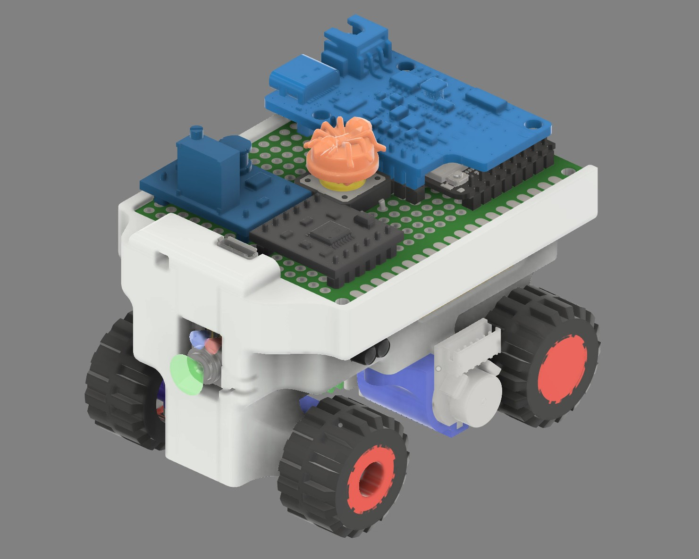

<center><h1>WRO 2025 Future Engineers – ANTi</h1></center>


<center>
<a href="https://www.instagram.com/anti.wro/"></a>
<a href="https://www.youtube.com/@solipsy."></a>
</center>

---

## 🏆 TURKISH NATIONAL CHAMPION – READY FOR SINGAPORE FINALS  

Welcome to the GitHub repository of **Team ANTi**, competing in the **World Robot Olympiad™ (WRO®) Future Engineers 2025** category. Our team is made up of Turkish students who have designed a compact, innovative, and autonomous self-driving vehicle to tackle the dynamic challenges of the WRO 2025 competition. Our team name, **ANTi**, reflects our philosophy: like an **ANT**, our robot is exceptionally small yet highly capable, pushing the boundaries of minimalism in design. The "**ANT**i" signifies our competitive spirit, standing "versus the world" in pursuit of engineering excellence.

Our mission was to create the smallest possible robot for the WRO 2025 challenge, leveraging our expertise in electrical, mechanical, and software engineering to test the limits of the 3 m x 3 m game field. After winning the Turkish National Final, we rebuilt, re-tuned, and re-documented every subsystem for the International Final in Singapore on 26–28 Nov 2025.
Current best times on the 3 m x 3 m field:
- **Open Challenge**: 16 s full score  
- **Obstacle Challenge**: 35 s full score  

Full videos are available in the [video folder](video/README.md).

 

The car keeps its title of **World's Smallest Self Driving Autonomous Vehicle** (about 1/76 scale, **69 mm x 53 mm x 57 mm**) while now carrying more intelligence and sensors than ever before. We challenged ourselves beyond the traditional competition rules by pursuing minimal size alongside advanced engineering functionality to further develop our **engineering knowledge**. 
Guided by our vision to **"never stop developing unless we stop learning,"** we have created a vehicle that showcases precision, adaptability, and a milestone in compact robotics design on a global scale. This documentation was last updated on **Wednesday, Nov 05 2025, at 06:11 AM +03**

---

## 📚 Table of Contents
- [📂 Folder Structure](#folder-structure)
- [👥 The Team](#the-team)
- [🎯 Challenge Overview](#challenge-overview)
- [🤖 Our Robot](#our-robot)
- [🔧 Hardware Documentation](#hardware-documentation)
- [💻 Software Documentation](#software-documentation)
- [⚙ Mechanical Characteristics](#mechanical-characteristics)
- [📹 Performance Videos](#performance-videos)
- [📸 Team Photos](#team-photos)
- [🚗 Vehicle Photos](#vehicle-photos)
- [🛠 Other Resources](#other-resources)
- [🌐 GitHub Utilization](#github-utilization)
- [📜 License](#license)

---

## 📂 Folder Structure <a id="folder-structure"></a>
```
📦 WRO2025_FE_ANTi
├── 📁 matlab                # MATLAB tools and simulations for virtual tests and verification
├── 📁 models                # 3D CAD models for printing and mechanical design characteristics
├── 📁 schemes               # Schematic diagrams, wiring and electronics information
├── 📁 src                   # Source code for robot control and strategy explanations
├── 📁 t-photos              # Team photos (official and fun)
├── 📁 v-photos              # Vehicle photos from multiple angles
├── 📁 video                 # Performance and testing videos
├── 📁 other                 # Additional resources (components, images, engineering details)
└── 📄 README.md             # Project overview and documentation
```


Detailed documentation for each folder is available in respective `.md` files:
- [MATLAB Documentation](matlab/README.md)
- [Models Documentation](models/README.md)
- [Schemes Documentation](schemes/README.md)
- [Software Documentation](src/README.md)
- [Team Photos](t-photos/README.md)
- [Vehicle Photos](v-photos/README.md)
- [Performance Videos](video/README.md)
- [Other Resources](other/README.md)

---

## 👥 The Team <a id="the-team"></a>
Team ANTi includes passionate students from Türkiye, guided by a coach. Each member brings unique skills to the project, from electronics to computer vision.


### Members
- **Atakan Ersoy** (Team Leader)  
  *Role*: Electronics, Mechanical Design, Software, Strategy Integration  
  *Background*: Sophomore, Electrical and Electronics Engineering, Koç University (2025)  
  *Contact*: [atakan@atakanersoy.com](mailto:atakan@atakanersoy.com), [aersoy24@ku.edu.tr](mailto:aersoy24@ku.edu.tr)  
  *Born*: 2006, Türkiye
- **Ege Özokan**  
  *Role*: Computer Vision Research, Strategy  
  *Background*: Freshman, Computer Engineering, Politecnico di Torino (2025)  
  *Born*: 2006, Türkiye

### Coach
- **Ali Aral Eren**  
  *Role*: Team Coach, Connector  
  *Background*: Alumni, Electrical and Electronics Engineering, Koç University (2025)  
  *Born*: 2003, Türkiye

---

## 🎯 Challenge Overview <a id="challenge-overview"></a>
The **WRO 2025 Future Engineers** category challenges teams to build an autonomous self-driving vehicle capable of navigating dynamic racetracks. The competition consists of two rounds:

### Open Challenge
- **Objective**: Complete three laps autonomously.
- **Track Conditions**: Randomly positioned internal walls create varied layouts and lane widths, testing adaptability and precision.

### Obstacle Challenge
- **Objective**: Complete three laps while respecting traffic signs and performing parallel parking.
- **Traffic Signs**:
  - *Red Signs*: Stay to the right of the lane.
  - *Green Signs*: Stay to the left of the lane.
- **Parking**: After three laps, locate and execute a precise parallel parking maneuver in a designated zone.

### Key Evaluation Areas
- Performance and adaptability in randomized conditions.
- Precision in maneuvers, especially parallel parking.
- Comprehensive, public engineering documentation on GitHub.

### Educational Emphasis
- Advanced *computer vision* and *sensor fusion*.
- Control systems for steering-based kinematics.
- Problem-solving, project management, teamwork, and creativity.
- Clear and detailed documentation of engineering processes.

This challenge fosters innovation in STEM and robotics, encouraging students to develop practical solutions to complex problems.

---

## 🤖 Our Robot <a id="our-robot"></a>


Team ANTi's robot is a marvel of minimalism, measuring just **69mm (L) x 53mm (W) x 57mm (H)**, making it the publicly known world's smallest autonomous vehicle ever designed for the WRO Future Engineers category. Built entirely from scratch, our robot features a **3D-printed chassis** and a custom built **Ackermann steering mechanism**, optimized for precision and small size. The processing is split between two microcontrollers for maximum efficiency. An **STM32H747 dual-core microcontroller** is dedicated to camera operations, processing data from the **GC2145 2MP camera**. A separate **nRF52832 microcontroller** handles all other sensor computations and data processing.

For navigation, the robot uses a front-mounted **VL53L1X ToF sensor** for general obstacle avoidance. For the specific challenge of detecting the obstacle parking start direction, it employs left and right **VL53L3CX ToF sensors**, which use a window lens for a narrow FoV to achieve long-range detection. Powered by a **1500 RPM N20 motor**, our design philosophy, inspired by the efficiency of an ant, pushes the boundaries of compact robotics while maintaining high performance.

Detailed vehicle photos with labels showing aspects of mobility, power systems, sensing, and obstacle management can be found at [Vehicle Photos](v-photos/README.md).


---

## 🔧 Hardware Documentation <a id="hardware-documentation"></a>
Our hardware is meticulously selected and integrated using custom **pertinax boards** for minimal size and weight. Below is a summary of all key components with images, followed by the complete Bill of Materials (BOM) for the wiring diagram.

### Key Components
| Component            | Description                                      | Image                                      |
|----------------------|--------------------------------------------------|--------------------------------------------|
| STM32H747            | Dual-core, high-performance camera microcontroller|  |
| GC2145               | 2MP CMOS camera, 80° view angle, <1.0% distortion |  |
| nRF52832             | Sensor microcontroller dedicated to handling sensor computations and data processing      |  |
| VL53L3CX             | ToF sensor with 700cm range using window lens for narrow FoV       |  |
| VL53L1X              | ToF sensor, 400cm range, full FoV                |  |
| LSM6DSOX             | 6-axis accelerometer and gyroscope IMU           |  |
| Feetech FS0307       | Submicro servo motor, chosen for minimal size    |  |
| DRV8833              | PWM motor driver                                 |  |
| 1500 RPM N20         | Brushed DC Motor with Hall effect magnetic encoder, selected for small size and speed |  |
| Power-Xtra PX103035  | 30x35x10mm, 1000mAh LiPo battery with PCM        |  |
| LiPo Rider Plus      | USB-C charger/booster with power switch          |  |
| SX1308               | 2A DC-DC Step-Up voltage booster                 |  |
| BOB-12009            | 3.3V–5V logic level converter                    |  |
| LEGO 87697           | Tire, 21mm diameter, 12mm width, good traction   |  |

### Microcontroller Selection
Beyond component selection, our microcontroller architecture was carefully chosen to balance processing power with compact size. We selected the STM32H747 and nRF52832 microcontrollers based on their widespread use in industrial projects and their universal applicability. These microcontrollers pack extensive features into their compact footprints while providing the processing power needed for our autonomous navigation system. 

For future developers, any microcontroller meeting the following requirements can achieve similar results, even without access to the exact same components:
- Sufficient processing power for computer vision algorithms
- Multiple communication interfaces (UART, I2C)
- Adequate PWM pins (typical: 3) for used motor and servo amounts
- Adequate GPIO pins for desired sensor integration
- Low power consumption for battery operation

We used evaluation boards of these microcontrollers to facilitate development while maintaining the compact form factor required for our design.

### Power Management Challenges and Solutions
With our components selected, we faced significant challenges in power distribution and management. During development, we encountered a critical power management issue. While reading the datasheets, we discovered that the power switch on the LiPo Rider Plus only controls the 5V output. After diving deep into the component's schematic, we figured out that the 3.3V output was derived directly from the 3.7V battery connected to an LDO regulator (low-dropout regulator). Further research into the LDO specifications revealed that 5V input for the LDO is also applicable to receive optimal ~3.3V output.

Our solution involved desoldering the unused but mounted USB-A input of the LiPo Rider Plus, then lifting the LDO by desoldering the input pin from the battery voltage. We applied Kapton tape to prevent any unwanted electrical connections and soldered the LDO input to the 5V output directly from the USB-A's mounted pin. This innovative fix ensured that all power rails are controlled by the LiPo Rider Plus power switch.


<p><em>Completed fix showing the 3.3V rail output LDO with input connected to the 5V rail controlled by the switch, with USB-A desoldered and unmounted.</em></p>

### Logic Level Conversion
The BOB-12009 logic level converter plays a critical role in our system, solving the voltage compatibility issue between our 3.3V microcontroller and the 5V servo motor. This ensures precise, safe, and reliable servo operation by converting the 3.3V control signals from the microcontroller to 5V signals required by the servo, preventing potential damage and ensuring accurate positioning.

### Thermal Management
Although we thoroughly researched all datasheets and specifications, we conducted comprehensive thermal tests to prevent any future problems. Our thermal analysis showed optimal operating temperatures across all critical components:

<p align="center">
  
  
  
  
</p>

- **Battery**: 25°C
- **Microcontroller**: 37°C  
- **Motor**: 29°C
- **Power Management Module**: 27°C

### Compact Board Design Innovation
Our compact design required innovative board manufacturing solutions to fit all electronics within the minimal footprint. Facing the challenge of fitting all components within our minimal size constraints, we developed an innovative double-layered pertinax board solution inspired by multi-layer PCB manufacturing. We managed to achieve a custom self-made double-layered pertinax connection on the same board, developing all our electronic boards using our own equipment instead of external manufacturing.


<p><em>Our innovative double-layered pertinax board design with mounted second-layer components.</em></p>

To prevent potential issues of top and bottom layers touching and creating unwanted heat/electrical connections, we applied Kapton tape on the bottom of the top-layer components, ensuring proper insulation and reliability.


<p><em>Complete top layer board with Kapton tape insulation.</em></p>

### Custom Connections and Manufacturing
We chose to implement custom connections on pertinax using sockets, headers, and self-soldered cables instead of externally manufactured PCBs. This approach provided several advantages: faster time for adjustments and improvements, complete control over the manufacturing process, and hands-on experience that significantly improved our engineering knowledge throughout the development process.

The use of sockets in our schematic design proved crucial for maintainability and testing. Sockets allow easy component replacement, facilitate testing individual components, and enable rapid prototyping iterations without damaging the main board.


<p><em>Complete pertinax board showing all cable connections with sockets for easy maintenance.</em></p>

### Cable Management
To prevent socket cables from bending excessively and causing breakpoints or connection issues, we implemented a strategic cable routing approach. Each cable passes through two different pertinax holes, distributing stress and minimizing bending at any single point, ensuring long-term reliability.

### Sensor Mounting Challenges
Sensor integration presented unique challenges that required creative mounting and interface solutions. We encountered a significant challenge with our ToF sensors' field of view (FoV) detecting the white ground when target objects (walls) passed a certain threshold distance. This was caused by two factors: the ToF sensors being mounted close to the ground due to our robot's minimal size, and the sensors' FoV intersecting with the ground beyond specific distances.

Our solution involved mounting the ToF sensors slightly angled upwards and implementing window lenses to decrease the FoV. These modifications significantly increased the threshold distance, allowing for longer and more accurate measurements.

### Ease of Use Features
We implemented a magnetic USB cable for the main camera microcontroller, providing practical advantages for frequent programming and debugging sessions. The magnetic connection allows quick disconnects, prevents port damage from constant plugging, and simplifies the development workflow.


<p><em>Front view showing the magnetic USB cable connection for the camera microcontroller (labeled with arrows).</em></p>

### Additional Hardware Details
- **Motor Speed**: Selected based on calculations comparing wheel/tire sizes and motor speeds for the 3m x 3m game field. You can see one of our comparisons with different wheels during the development process from [motor_speed_calculations.jpg](other/motor_speed_calculations.jpg). The final configuration achieves a theoretical maximum speed of **1.72 m/s**, calculated from the 1500 RPM N20 motor through a 26:25 gear reduction driving the 21mm diameter wheels. The Calculation is as Follows:

  - The wheel RPM is calculated as:

  $$
  \text{RPM}_{\text{wheel}} = \text{RPM}_{\text{motor}} \times \text{Gear Ratio} = 1500 \times \frac{26}{25} = 1560 \, \text{RPM}
  $$

  - The speed is calculated using:

  $$
  \text{Speed} = (2 \times \pi \times r) \times \frac{\text{RPM}_{\text{wheel}}}{60}
  $$

  - Where the radius in meters is:

  $$
  r = \frac{21 \, \text{mm}}{2} = 10.5 \, \text{mm} = 0.0105 \, \text{m}
  $$

  - Thus, the speed can be calculated as:

  $$
  \text{Speed} = (2 \times \pi \times 0.0105) \times \frac{1560}{60} \approx 1.72 \, \text{m/s}
  $$

- **Battery Performance**: 
  - **Run Time:** The battery is capable of operating for approximately 4 to 5 hours under typical usage conditions. This duration can vary based on the load and the efficiency of the connected components.
  
  - **Charge Time:** The battery requires about 45 minutes to reach a full charge when connected to a USB-C port at 5V. This charging process utilizes a maximum input power of 10W at 2A, ensuring efficient energy transfer.

  - **Power Specifications:** The minimum power draw during operation is around 0.8W, while the total current consumption fluctuates between 200 to 250 mA, depending on the specific demands of the device while regulating the voltage levels.

  All calculations related to these performance metrics were performed using watt-voltage relationships, ensuring accurate assessments of the battery's capabilities.

- **3D Printing**: Used for prototyping (see [models/3d_printer.jpg](models/3d_printer.jpg)).


<p><em>Our soldering setup for assembling the pertinax boards.</em></p>


<p><em>Complete wiring diagram.</em></p>

### Bill of Materials (BOM) for Wiring Diagram
The following BOM details all components used in the robot's electrical system, as documented in the [Schemes Documentation](schemes/README.md):

| Component           | Quantity | Type                      | Description                                   |
|---------------------|----------|---------------------------|-----------------------------------------------|
| STM32H747           | 1        | Camera Microcontroller    | Dual-core, high-performance microcontroller   |
| GC2145              | 1        | 2MP Camera                | 2MP CMOS camera, 2.2mm focal length, 80° view |
| nRF52832            | 1        | Sensor Microcontroller    | Handling sensor computations and data processing   |
| VL53L3CX            | 2        | ToF Sensor                | ToF sensor, 700cm range, narrow FoV window lens    |
| VL53L1X             | 1        | ToF Sensor                | ToF sensor, 400cm range, full FoV             |
| LSM6DSOX            | 1        | 6-axis IMU                | 6-axis accelerometer and gyroscope IMU        |
| Feetech FS0307      | 1        | Servo Motor               | Submicro servo motor                          |
| DRV8833             | 1        | Motor Driver              | PWM motor driver                              |
| 1500 RPM N20        | 1        | DC Motor with Encoder     | Motor with quadrature encoder (2 Hall-effect) |
| Power-Xtra PX103035 | 1        | 3.7V 1000mAh LiPo Battery | 3.7V 1000mAh LiPo battery with PCM            |
| LiPo Rider Plus     | 1        | Charger/Booster           | USB-C charger/booster with power switch       |
| SX1308              | 1        | Voltage Booster           | 2A DC-DC Step-Up voltage booster              |
| BOB-12009           | 1        | Logic Level Converter     | 3.3V–5V logic level converter                 |
| KLS7-TS1204         | 1        | Tactile Switch            | Tactile switch (start action)                 |
| LEGO 87697          | 4        | Tire                      | Tire, 21mm diameter, 12mm width               |

For detailed schematics, power distribution, and wiring information, refer to the [Schemes Documentation](schemes/README.md).

---

## 💻 Software Documentation <a id="software-documentation"></a>
Our camera software is written in **MicroPython** and runs on the STM32H747. It uses the **CIELAB color space** for robust computer vision, enabling precise differentiation of track elements and traffic signs. The software integrates sensor data (camera, ToF, IMU) for navigation and control, with algorithms optimized for the dynamic WRO racetrack. Our side sensor software is written in **Arduino IDE** and runs on the nRF52832. These two microcontrollers constantly maintain a stable and bidirectional communication using the UART protocol.

### Color Space Selection and Object Detection
We chose the CIELAB color space for object detection because it provides superior color differentiation under varying lighting conditions compared to traditional RGB or HSV spaces. Our custom `ANTi_threshold_finder.m` MATLAB code helped us determine optimal thresholds for reliable detection.

We conducted extensive edge case scenario tests with multiple challenging lighting conditions to validate our approach:


<p><em>Testing under challenging lighting conditions with strong sunlight from windows.</em></p>


### Obstacle Navigation Strategy
Our robot navigates the obstacle course using a combination of sensor fusion and computer vision:
- **Traffic Sign Detection**: The GC2145 camera detects red/green signs using CIELAB color space. Red signs trigger a right-lane adjustment, green signs a left-lane adjustment. The amount of this adjustment is calculated based on the colored objects position on the camera window.

- **Obstacle Following Logic**: We maintain obstacles at a consistent X pixel position in the camera frame, ensuring the robot keeps a constant optimal distance. This approach, combined with our strategically placed bottom and front camera, provides smooth and precise obstacle adjustments with minimal oscillation.

- **Obstacle Avoidance**: The VL53L1X ToF sensor provides distance data to detect obstacles, adjusting the robot's path.

- **Parallel Parking**: After three laps, the robot uses ToF and camera data to locate the parking zone and execute a precomputed trajectory (see [parallel_park_setup.jpg](src/parallel_park_setup.jpg)).


#### Navigation Flow Diagram
1. Start → Initialize sensors (Camera, ToF, IMU).
2. Leave the parking zone
3. Loop:
   - Capture camera frame → Detect track and signs using CIELAB.
   - If sign detected:
     - Red → Adjust steering to right based on sign position.
     - Green → Adjust steering to left based on sign position.
   - Read ToF distance → If obstacle or wall < 10cm, adjust path.
   - Update steering and speed via PID control.
4. After 3 laps → Locate parking zone → Execute parking maneuver.

#### Pseudocode for Obstacle Challenge (Sign Detection and Parking)
```
INITIALIZE sensors (camera, tof, imu, encoder)
FOR 4 laps:
    MOVE 50cm
    DETECT red, green, magenta, distance
    IF magenta: MOVE 10cm → STOP
    IF distance < 100cm:
        IF red: AVOID right
        IF green: AVOID left
        ELSE: AVOID right
    ELSE IF lap < 3: TURN 90°
STOP
```


See [Software Documentation](src/README.md) for details on algorithms, libraries, and code structure.

---

## ⚙ Mechanical Characteristics <a id="mechanical-characteristics"></a>
Our robot's mechanical design prioritizes compactness and durability:
- **Dimensions**: 69mm (L) x 53mm (W) x 57mm (H).
- **Total Weight**: ~130g.
- **Chassis**: 3D-printed ABS chassis.
- **Mechanical Parts**: All mechanical parts were designed in Autodesk Fusion and 3D printed with ABS material using FDM printers.
- **Differential**: Custom 4-gear mechanical differential.
- **Tires**: LEGO 87697 (21mm diameter, 12mm width), selected for the small size, suitability, good performance, and traction, featuring a circumferential center ridge compared to similar alternative parts.
- **Wheel Bearings**: We implemented bearings on all four wheel rims to minimize mechanical tolerance, significantly improving stability and performance by reducing friction and ensuring smoother rotation.
- **Wheel Rotation Limits**: Mechanically limited to -50° to +32° per wheel, an asymmetry derived from Ackermann steering design, ensuring each wheel points toward the same circular center point for smooth turns.
- **Engineering Principles**:
  - **Speed**: The 1500 RPM N20 motor was chosen to achieve a target speed of ~1.4 m/s on the 3m x 3m track. Although the maximum speed is calculated as ~1.72 m/s, the operation speed is reduced to 1.4 m/s via PWM control for stability during high momentum turns.
  - **Torque**: Estimated at ~0.25 Nm for the N20 motor at 6V based on the datasheets, sufficient for the lightweight ~130g robot on a flat track (Force = mass × acceleration, Torque = Force × wheel radius).
- **Assembly Instructions**:
  1. 3D print the chassis using ABS (files in [models/design_base.3mf](models/design_base.3mf)).
  2. Mount the N20 motor to the rear differential using M2 screws.
  3. Attach the Feetech FS0307 servo to the front steering mechanism.
  4. Secure pertinax boards with electronics to the chassis by sliding.
  5. Install LEGO 87697 tires and bearings on all four wheels.

  

- **CAD Files**: Available at [models/design_base.3mf](models/design_base.3mf) and [models/4_gear_design_mini_differential.3mf](models/4_gear_design_mini_differential.3mf) for replication or modification.



Detailed mechanical specifications are in [Models Documentation](models/README.md).

---

## 📹 Performance Videos <a id="performance-videos"></a>
Videos showcasing our robot's performance in testing and competition scenarios are available in [Performance Videos](video/README.md). Both videos include autonomous robot movements doing key maneuvers, referencing [Hardware](#hardware-documentation), [Software](#software-documentation), and [Mechanical Characteristics](#mechanical-characteristics) in live action.

Our obstacle navigation goal was to achieve the fastest time worldwide while maintaining the least oscillation and implementing the smoothest target-driven algorithm. We designed our system to always form the shortest path according to challenge goals with pillars or inner walls. We successfully achieved this goal, creating a solution that is both fast and exceptionally smooth.

- **Open Challenge**  
  [](https://youtu.be/tvqgwusap9M)  
  *Demonstrates autonomous navigation and speed control on a dynamic track.*

- **Obstacle Challenge**  
  [](https://youtu.be/fQPjyJrE8p8)  
  *Shows traffic sign detection, obstacle avoidance, optimal path planning and parallel parking with smooth obstacle following at consistent distances.*

---

## 📸 Team Photos <a id="team-photos"></a>
Official and informal photos of Team ANTi are available in [Team Photos](t-photos/README.md).

<p align="center">
  
  
</p>

> 💡 *Fun Fact*: The fun team photo (`team_fun.jpg`) is our childhood photo from 2015, when we were 9 years old, standing on a go-kart race podium!

---

## 🚗 Vehicle Photos <a id="vehicle-photos"></a>
Detailed photos of our robot from all angles (top, bottom, front, back, left, right) are in [Vehicle Photos](v-photos/README.md).


---

## 🛠 Other Resources <a id="other-resources"></a>
Additional resources, including datasheets, communication protocols, and custom pertinax PCB details, are in [Other Resources](other/README.md).

- All logos and visual media edits were created by our team using the **ibisPaint X** mobile application. Video edits were also done by our team using **CapCut** for professional presentation of our performance videos.

- `ackermann_steering_path.png`: Simulation of our own Ackermann steering design path for a 90-degree turn.  
  

---

## 🌐 GitHub Utilization <a id="github-utilization"></a>
We leveraged GitHub as our central platform for version control, project management, and public sharing, while maintaining a clean and professional repository history:
- **Development Workflow**: We worked on local computers directly connected to our GitHub repository. To keep our repository history clean and avoid overcommitting, we committed changes only at significant milestones (e.g., completing the chassis design, integrating the vision system, finalizing obstacle navigation). Locally, we used sub-folders like `vision` and `steering` to develop features, when committing merging them into our local main branch before pushing polished updates to the public repository.
- **Commit Frequency**: From March to May 2025, we achieved 10 major milestones, resulting in 10 commits to the public repository, averaging ~1 commits per week. Each commit represents a significant, well-documented update, such as "Completed sensor tests" or "Updated README docs".
- **File Sharing and Public Updates**: All project assets, CAD files (`models/`), schematics (`schemes/`), source code (`src/`), and GitHub documentation are shared publicly at each milestone. Before pushing updates, we cleaned up our progress, data, and results to ensure the public repository reflects a safer and smoother development process than our local workflow, making it easier for others to understand and replicate. Additionally, we record the date and time of the last updates in the README documents, providing easy access to the commit date and version.
- **Supporting Others and Future Development**: While we do not want others to simply copy our work for private or closed-source use, we intentionally chose the AGPL-3.0 license to ensure that any future developments based on our code, robot design, hardware system, or overall architecture remain open-source. This strong copyleft license guarantees that improvements or adaptations, whether for competition, education, or research, must also be shared with the community. We are inviting others to replicate, modify, or build upon our work. The modular design of our system and detailed documentation make it easy to adapt the robot for different challenges. Contributions and suggestions, such as adding multi-robot coordination or advanced path-planning, are welcome via GitHub issues.

### Future Improvements
For future developers looking to build upon our work, we suggest considering these potential enhancements:
- Implementation of more advanced sensor fusion algorithms
- Addition of wireless communication for real-time performance monitoring only for debugging process
- Integration of machine learning algorithms if the color thresholding cannot be done properly for adaptive behavior in unknown environments
- Development of a custom modular sensor system for easy reconfiguration with the already existing sockets
- Implementation of further energy-saving modes for extended operation

We challenged ourselves beyond the traditional competition rules to further develop our engineering knowledge across all aspects of the project, and we encourage future teams to continue this philosophy of pushing boundaries while maintaining comprehensive documentation.

---

## 📜 License <a id="license"></a>
This project is licensed under the **GNU Affero General Public License v3.0 (AGPL-3.0)** to ensure all developments remain publicly accessible, fostering open collaboration and innovation.

```
GNU Affero General Public License v3.0

Copyright (C) 2025 Atakan Ersoy (atakanersoy)

This program is free software: you can redistribute it and/or modify
it under the terms of the GNU Affero General Public License as published
by the Free Software Foundation, either version 3 of the License, or
(at your option) any later version.

This program is distributed in the hope that it will be useful,
but WITHOUT ANY WARRANTY; without even the implied warranty of
 MERCHANTABILITY or FITNESS FOR A PARTICULAR PURPOSE. See the
GNU Affero General Public License for more details.

You should have received a copy of the GNU Affero General Public License
along with this program. If not, see <https://www.gnu.org/licenses/>.
```