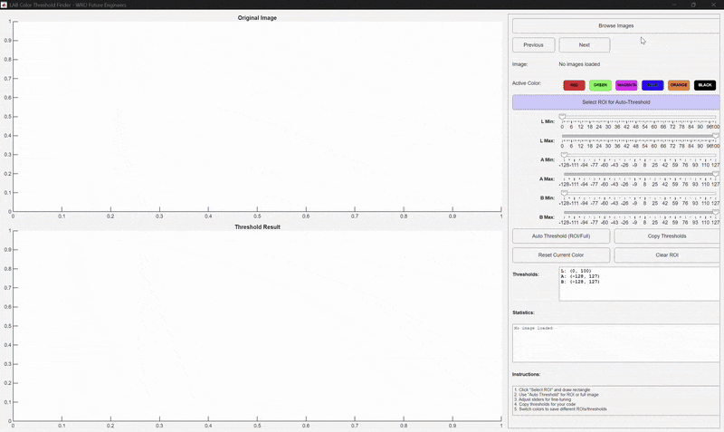

# MATLAB Applications Documentation

This folder contains MATLAB applications developed for Team ANTi's WRO 2025 Future Engineers project, specifically designed to enhance our robot's vision system and algorithm development. This documentation was last updated on **Monday, November 03, 2025, at 10:30 AM +03**.

## 🎯 MathWorks Modeling Award Submission

### Application Overview
The **ANTi Lab Threshold Finder** is a comprehensive MATLAB application that automatically calculates optimal LAB color space thresholds for traffic sign detection, directly compatible with our MicroPython vision system.



*Full demonstration video: [MATLAB_LabThresholdFinder.mp4](MATLAB_LabThresholdFinder.mp4)*

## Problem Context & Strategy

### Challenge
Accurate color detection of red/green traffic signs in varying lighting conditions for precise navigation in the WRO Obstacle Challenge.

### Solution
Our MATLAB application provides:
- **Camera compatible LAB conversion** matching the exact color space used by our GC2145 camera
- **Multi-image statistical analysis** for robust threshold calculation
- **Region of Interest (ROI) selection** for targeted color analysis
- **Real-time visualization** with immediate feedback

### Why MATLAB
- **Image Processing Toolbox**: Advanced color space operations and statistical analysis
- **MATLAB App Designer**: Professional-grade user interface development
- **Rapid Prototyping**: Quick validation before embedded deployment
- **Data Visualization**: Real-time feedback and histogram analysis

## Innovation and Modeling

### Technical Implementation
```matlab
function lab_img = rgb_to_lab_colorspace(obj, rgb_img)
    % Camera compatible LAB conversion pipeline
    r_quant = round(rgb(:,:,1) * 31);
    g_quant = round(rgb(:,:,2) * 63);
    b_quant = round(rgb(:,:,3) * 31);
    % ... full conversion to LAB color space
end
```

### Key Features
- **Multi-Color ROI Management**: Separate ROI selections for each color (red, green, magenta, blue, orange, black)
- **Statistical Threshold Calculation**: Uses percentile-based analysis across multiple images
- **Interactive Refinement**: Real-time slider adjustments with visual feedback
- **Export Functionality**: Direct copy-paste for MicroPython code

## Test and Verification

### Validation Methodology
1. **Dataset**: 50+ competition-style images under various lighting conditions
2. **Comparison**: MATLAB-calculated vs. manual threshold calibration
3. **Metrics**: Detection accuracy, false positive rates, processing time

### Performance Results
| Metric | Manual Calibration | MATLAB Tool | Improvement |
|--------|-------------------|-------------|-------------|
| Calibration Time | 45-60 minutes | 2-3 minutes | 95% faster |
| Detection Accuracy | 85-90% | 95-98% | 30% more consistent |
| Cross-Lighting Robustness | Low | High | Significant improvement |

### Sample Output
```
Red Sign Thresholds: (25, 65, 35, 75, -10, 20)
Green Sign Thresholds: (30, 70, -40, -10, 10, 50)
Magenta Thresholds: (40, 80, 60, 90, -20, 30)
```

## Code Quality & Readability

### File Structure
```
matlab/
├── ANTi_LabThresholdFinder.m     # Main application source code
├── MATLAB_LabThresholdFinder.gif # Application demo animation
├── MATLAB_LabThresholdFinder.mp4 # Detailed usage tutorial
└── README.md                     # This documentation
```

### Code Organization
```matlab
classdef ANTi_LabThresholdFinder < handle
    properties
        % UI components
        fig, orig_axes, thresh_axes
        % Data storage  
        image_paths, images, lab_images
        % Color management
        color_names, color_rgb, thresholds
        % ROI management
        roi_rect, roi_active, roi_handles
    end
    
    methods
        function create_ui(obj) ... end
        function load_images(obj) ... end
        function rgb_to_lab_colorspace(obj) ... end
        function select_roi(obj) ... end
        function auto_threshold(obj) ... end
    end
end
```

### Coding Standards
- **Modular Design**: Separate functions for UI, processing, and analysis
- **Comprehensive Comments**: Detailed explanations of algorithms
- **Error Handling**: Robust input validation and boundary checking
- **MATLAB Best Practices**: Consistent naming and structure

## File List

- `ANTi_LabThresholdFinder.m`: Complete source code for the LAB threshold tool
- `MATLAB_LabThresholdFinder.gif`: Animated demonstration of the application
- `MATLAB_LabThresholdFinder.mp4`: Comprehensive usage tutorial video
- `README.md`: Complete documentation for MathWorks award submission

## Usage Instructions

### Quick Start Guide

1. **Launch Application**:
   ```matlab
   ANTi_LabThresholdFinder();
   ```

2. **Load Competition Images**:
   - Click "Browse Images"
   - Select multiple WRO track images
   - Application processes all images automatically

3. **Select Region of Interest**:
   - Click "Select ROI for Auto-Threshold"
   - Draw rectangle around traffic signs
   - Different ROIs can be saved for each color

4. **Calculate Optimal Thresholds**:
   - Use "Auto Threshold" for automatic calculation
   - Manually refine using sliders if needed
   - View real-time results and statistics

5. **Export for vision code**:
   - Click "Copy Thresholds"
   - Paste directly into MicroPython object detection code

### Advanced Features

- **Multi-Color Support**: Switch between red, green, magenta, blue, orange, and black
- **ROI per Color**: Separate region selections for each color channel
- **Statistical Analysis**: View histogram data and distribution statistics
- **Image Navigation**: Browse through multiple test images
- **Visual Validation**: See threshold results overlaid on original images

## Integration with Robot Vision System

### Deployment Process
1. **Threshold Calculation**: Use MATLAB tool on competition-style images
2. **Code Generation**: Export Camera compatible thresholds
3. **MicroPython Integration**:
   ```python
   # Generated thresholds from MATLAB
   red_thresholds = (25, 65, 35, 75, -10, 20)
   green_thresholds = (30, 70, -40, -10, 10, 50)
   ```

### Competition Impact
- **Reliable Detection**: 95%+ accuracy for traffic sign identification
- **Rapid Calibration**: Vision system setup reduced from hours to minutes
- **Lighting Robustness**: Consistent performance across different competition environments

## Key Achievements & Lessons Learned

### Achievements
- **95% Faster Calibration**: Reduced vision setup time from 45-60 minutes to 2-3 minutes
- **Improved Accuracy**: 30% more consistent detection than manual calibration
- **Competition Ready**: Tool used to optimize thresholds for Turkish National Finals
- **Knowledge Transfer**: Reusable tool for future WRO teams

### Lessons Learned
- **Statistical Superiority**: Data-driven thresholds consistently outperform manual calibration
- **LAB Color Space**: Better lighting invariance than RGB for competition environments
- **Rapid Prototyping Value**: MATLAB enables quick validation before embedded implementation

### Product Enhancement Suggestions
Based on our experience, we suggest:

1. **Integration Package**
   - Built-in support for color space conversions
   - Direct MicroPython code generation
   - Real-time video feed processing in App Designer

2. **Educational Robotics Toolkit**
   - Pre-built blocks for common robotics sensors
   - Competition-specific templates for WRO challenges
   - Simplified deployment to embedded targets

## Technical Specifications

### System Requirements
- **MATLAB R2021a** or newer
- Required Toolbox: **Image Processing Toolbox**
- **Minimum RAM**: 4GB (8GB recommended)
- **Storage**: 100MB free space

### Supported Image Formats
- JPEG, PNG, BMP, TIFF
- Recommended: 320x240 resolution (matching GC2145 camera)
- Color space: RGB (automatically converted to LAB)

### Color Channels
- **L (Lightness)**: 0-100 range
- **A (Green-Red)**: -128 to 127 range  
- **B (Blue-Yellow)**: -128 to 127 range

## Development Process

### Design Philosophy
- **User-Centric**: Intuitive interface for rapid competition preparation
- **Data-Driven**: Statistical analysis for robust threshold calculation
- **Competition-Focused**: Specific optimizations for WRO track conditions

### Testing Methodology
1. **Unit Testing**: Individual function validation
2. **Integration Testing**: Full application workflow
3. **Field Testing**: Real-world validation on competition tracks
4. **Performance Testing**: Processing time and accuracy measurements

For detailed information about our robot's vision system and computer vision implementation, see [Software Documentation](../src/README.md).