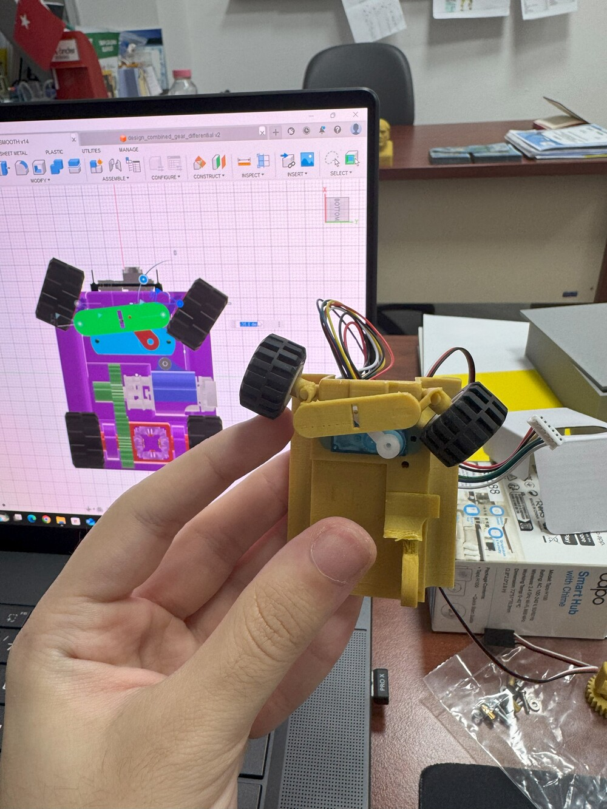
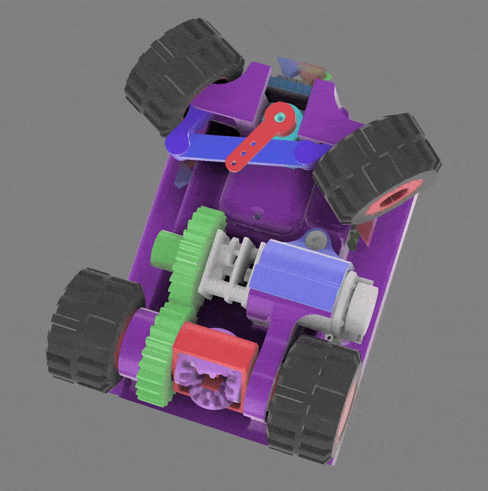
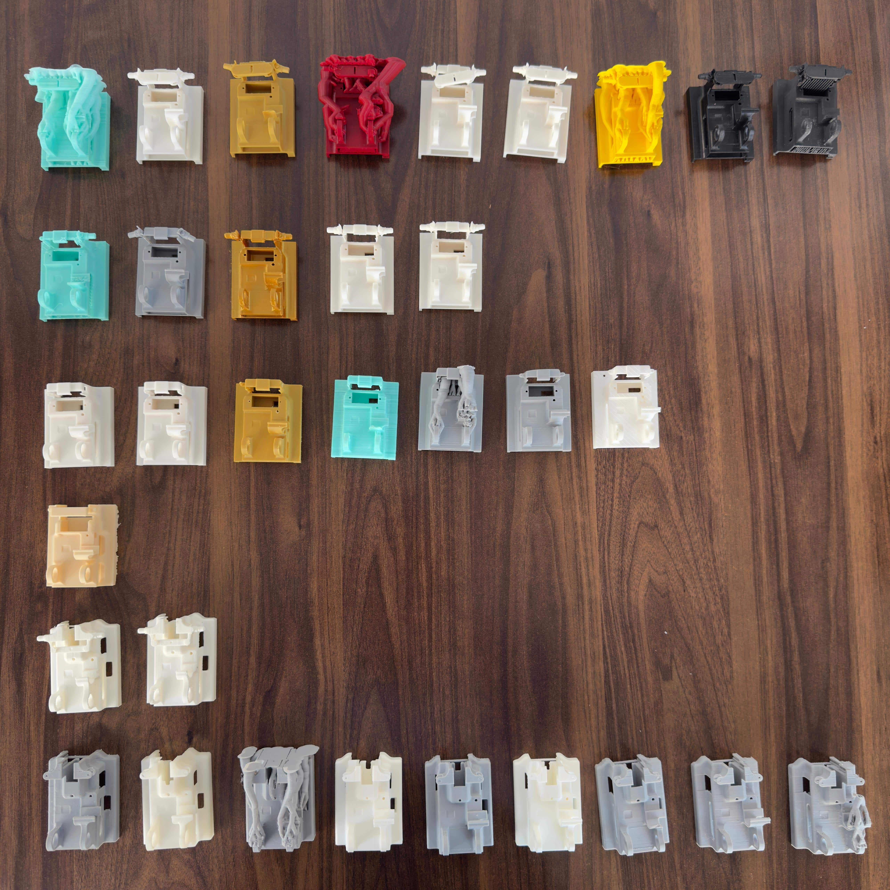
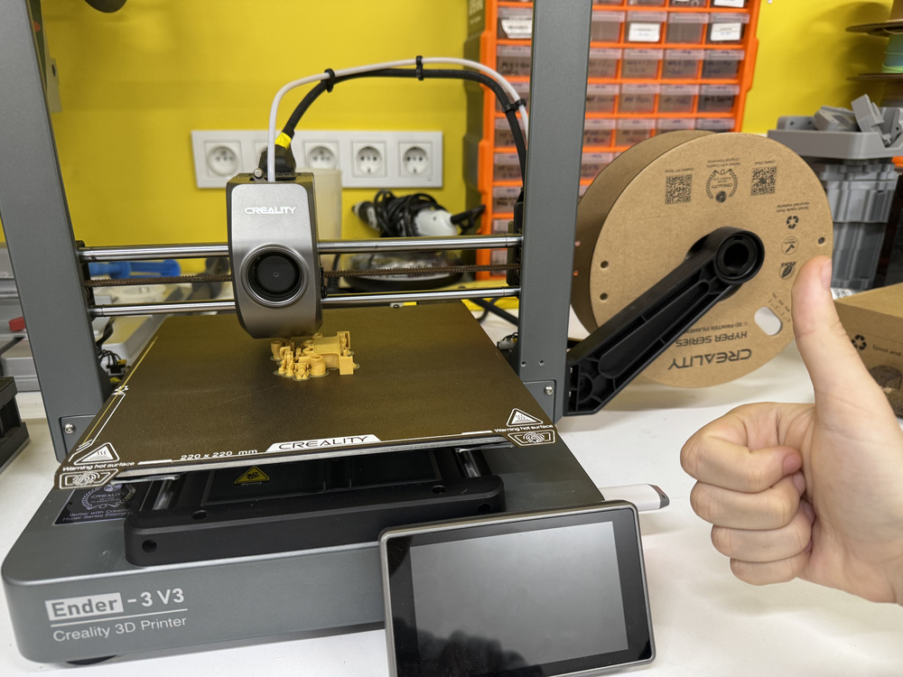
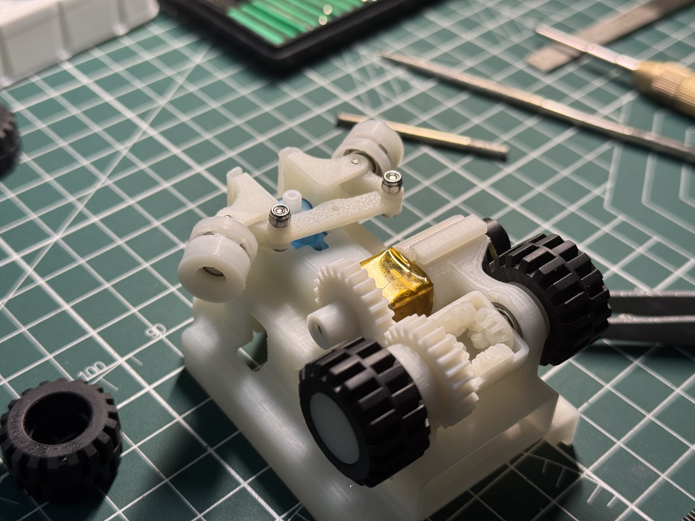
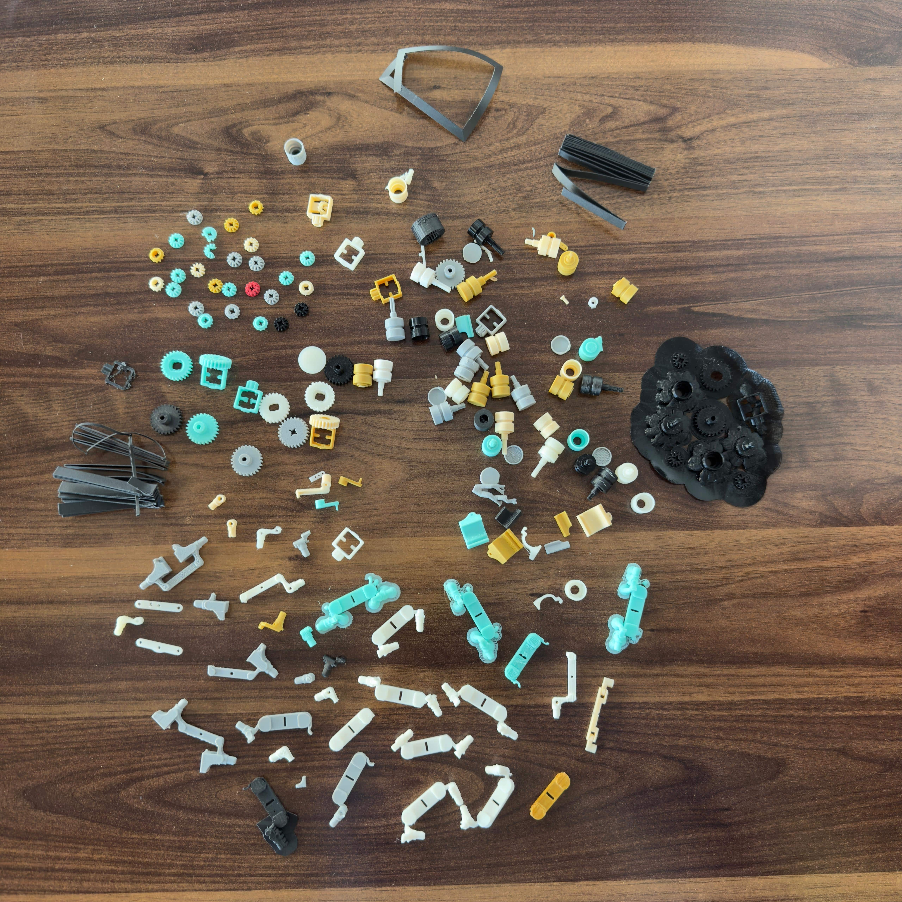
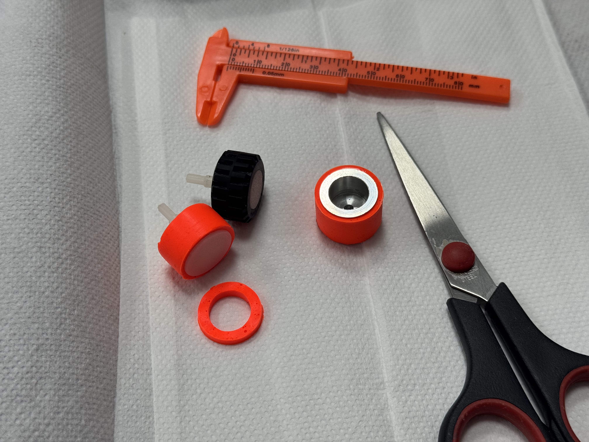

# Models Documentation

This folder contains the complete 3D CAD models and manufacturing files for Team ANTi's WRO 2025 Future Engineers robot. All mechanical components were custom-designed and manufactured in-house to achieve our goal of creating the world's smallest autonomous vehicle while maintaining optimal performance. This documentation was last updated on **Thursday, November 06, 2025, at 06:43 AM +03**.

## Mechanical Design Philosophy

Our design philosophy centered around **minimalism without compromise** - achieving the smallest possible footprint while ensuring robust mechanical performance. The entire chassis measures just **69mm × 53mm × 57mm** with a total weight of **~130g**, making it the smallest autonomous vehicle in WRO Future Engineers category.

*Virtual CAD design background with physical implementation in hand*

## Core Mechanical Systems

### Custom Ackermann Steering Geometry
The steering system implements true Ackermann principles where each wheel points toward a common center point during turns, minimizing tire scrub and maximizing stability.

*Ackermann steering and differential simulation in Autodesk Fusion CAD*  
*Higher quality video: [3d_CAD_motion.mp4](../video/3d_CAD_motion.mp4)*

**Key Features:**
- **Wheel Rotation Limits**: -50° to +32° per wheel for true Ackermann geometry
- **Precision Assembly**: 4 M2 screws and 2 M2 lock nuts in steering linkage
- **Minimal Play**: Engineered for exact steering control

### 4-Gear Mechanical Differential
Our custom differential ensures smooth power distribution to both rear wheels during turns, preventing wheel slip and maintaining traction.

*Physical differential test showing wheel independence*  
*Higher quality video: [differential_test.mp4](../video/differential_test.mp4)*

**Gear Specifications:**
- **Spur Gears**: 25-tooth and 26-tooth for 26:25 reduction ratio
- **Bevel Gears**: 12-tooth for differential action
- **Smooth Operation**: Optimal power distribution in all conditions

### Chassis and Structural Design
The main chassis integrates all mechanical and electronic systems while maintaining structural integrity.

*Chassis design evolution through multiple iterations*

**Structural Elements:**
- **Integrated Mounting**: Slots for pertinax boards, servo, motor, and battery
- **Weight Optimization**: Balanced mass for stable navigation
- **Bearing System**: Four bearings for smooth wheel rotation

## Manufacturing Process

### 3D Printing Equipment
We tested multiple printers and primarily used the Ender 3v3 for final production.

*Ender 3v3 printer in operation*

**Printers Used:**
- **Ender 3v3**: Primary printer for final components
- **Zaxe Z3S**: Tested and evaluated during development with PLA and ABS materials
- **Bambu Lab A1**: Tested and evaluated during development with PLA material tests

### Material Selection
**Final Material: Hyper ABS from Creality**  
Selected for optimal strength, layer adhesion, and print quality on our Ender 3v3.

**Materials Tested:**
- **Hyper ABS (Final)**: Excellent strength and printability
- **ABS+**: Good alternative used in national tournament
- **PLA**: Prototyping only - lacked durability
- **PETG**: Challenging to print with precision issues
- **SLA Resin**: High detail but too fragile
- **CFR Composites**: Excellent strength but complex requirements

**Printing Parameters:**
- **Layer Height**: 0.08mm–0.1mm
- **Infill**: 30–40% structural, 100% gears
- **Nozzle**: 0.4mm at 240-250°C
- **Bed**: 90-100°C for optimal adhesion

### Assembly Process

*Intermediate assembly stage showing mechanical systems*

**Assembly Steps:**
1. Differential and gear installation
2. Ackermann steering mechanism
3. Wheel and bearing integration
4. Electronic component mounting
5. Final system alignment

## Component Development

*Development iterations of gears, differentials, and mechanical parts*

**Development Scope:**
- Multiple gear design generations
- Steering mechanism optimizations
- Rim and axle variants
- Motor enclosure improvements

## Wheel and Tire System

### LEGO Wheel Selection
After extensive testing, we selected LEGO 87697 wheels for optimal performance.

*Comparison of LEGO wheel variants*

**Selected: LEGO 87697**
- 21mm diameter, 12mm width
- Circumferential center ridge
- SEBS material with optimal traction

### Tire Testing

*LEGO vs silicone tire comparison*

**Selection Rationale:**
- Both tires provided similar traction with our light weight
- High momentum reduced traction dependency
- LEGO wheels offered consistent performance
- Perfect compatibility with our custom rims

## Engineering Calculations

**Motor & Drive Train:**
- **Motor**: 1500 RPM N20 DC with encoder
- **Gear Ratio**: 26:25 reduction
- **Wheel RPM**: 1560 RPM
- **Max Speed**: 1.72 m/s theoretical
- **Operational Speed**: 1.4 m/s controlled

**Performance:**
- **Motor Torque**: ~0.25 Nm at 6V
- **Structural Integrity**: Optimized for operational loads
- **Bearing System**: Minimal friction design

## Complete File List

### Primary Design Files
- `design_base.3mf` - Main chassis
- `4_gear_design_mini_differential.3mf` - Differential assembly
- `design_ackermann_servo_arm.stl` - Steering components

### Wheel System
- `design_front_rim_bearing.3mf` - Front rims
- `design_back_rim_long.3mf` - Long rear rims
- `design_back_rim_short.3mf` - Short rear rims

### Gear Components
- `design_spur_25_gear.stl` - 25-tooth gear
- `design_spur_26_gear.stl` - 26-tooth gear
- `long_design_bevel_12_gear.stl` - Long bevel gear
- `short_design_bevel_12_gear.stl` - Short bevel gear

### Support Components
- `design_motor_lid.stl` - Motor enclosure

### Documentation
- `building_steps.jpg` - Assembly process
- `3d_printer.jpg` - Manufacturing setup
- `main_base_development.jpg` - Chassis evolution
- `parts_development.jpg` - Component development
- `silicone_tire_test.jpg` - Tire testing
- `design_to_life.jpg` - Design journey
- `3d_CAD_motion.gif` - CAD simulation
- `differential_test.gif` - Mechanism testing

## Design Process

1. **Conceptual Design**: Minimal size with Ackermann geometry
2. **CAD Modeling**: Precision design in Fusion 360
3. **Prototyping**: Multiple iterations for optimization
4. **Testing**: Competition condition validation

## Testing & Validation

- **Differential Operation**: Smooth power distribution
- **Steering Geometry**: True Ackermann implementation
- **Structural Integrity**: Load and impact testing
- **Track Performance**: Real-world competition validation

This comprehensive documentation enables exact duplication of our mechanical systems while demonstrating engineering excellence for WRO 2025 Future Engineers.

For electrical systems: [Schemes Documentation](../schemes/README.md)  
For performance videos: [Video Documentation](../video/README.md)  
For component details: [Other Resources](../other/README.md)