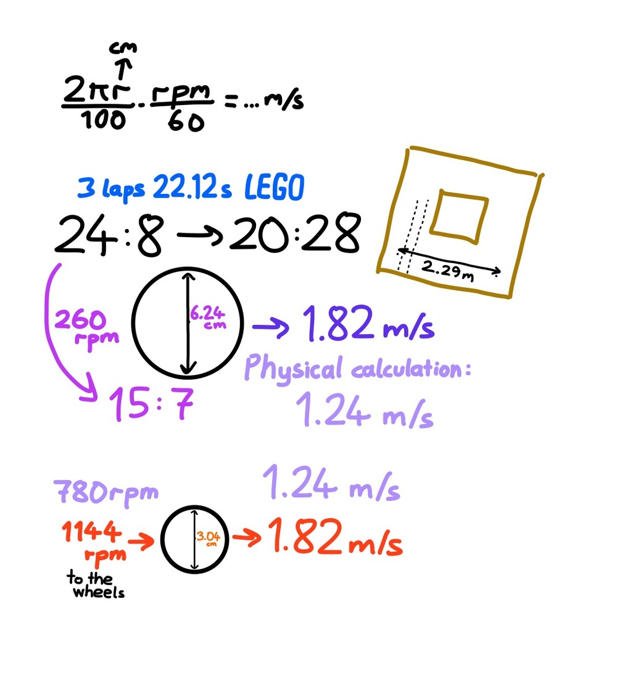
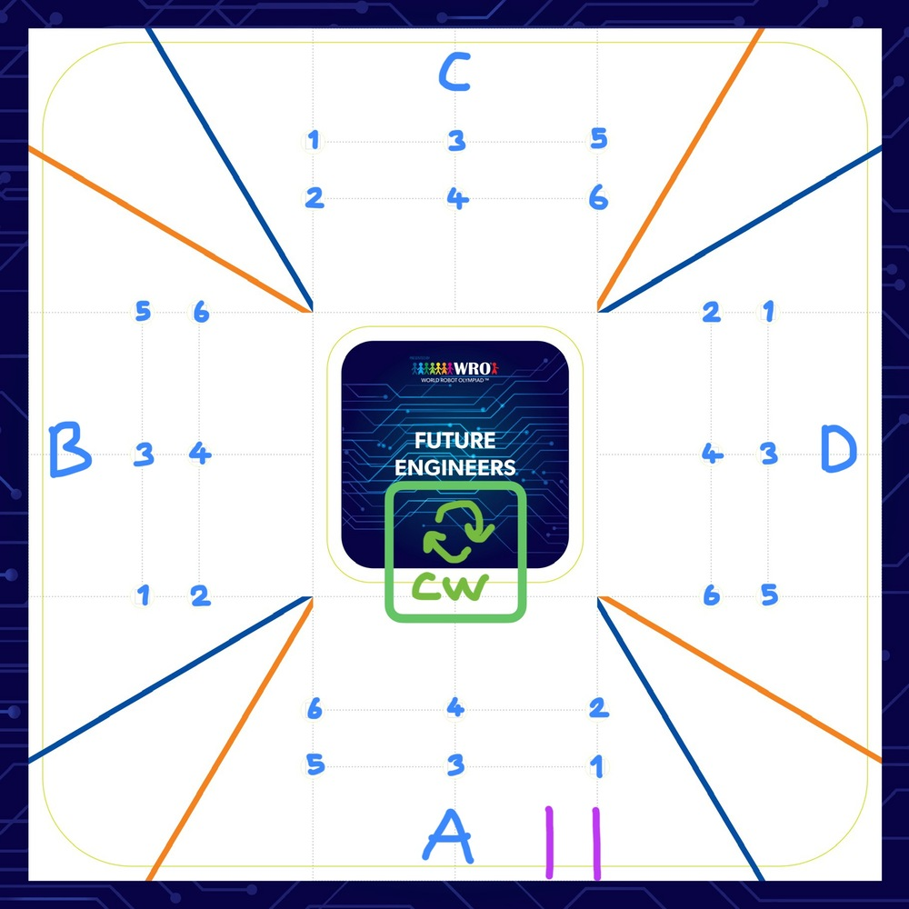
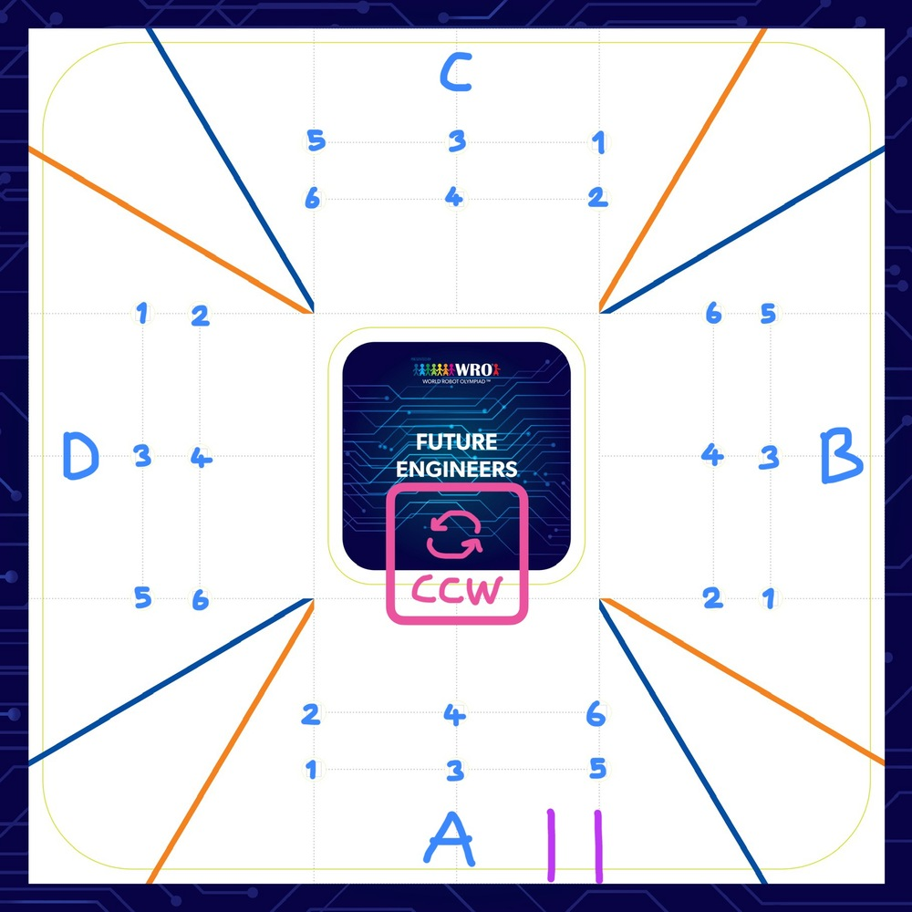
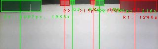
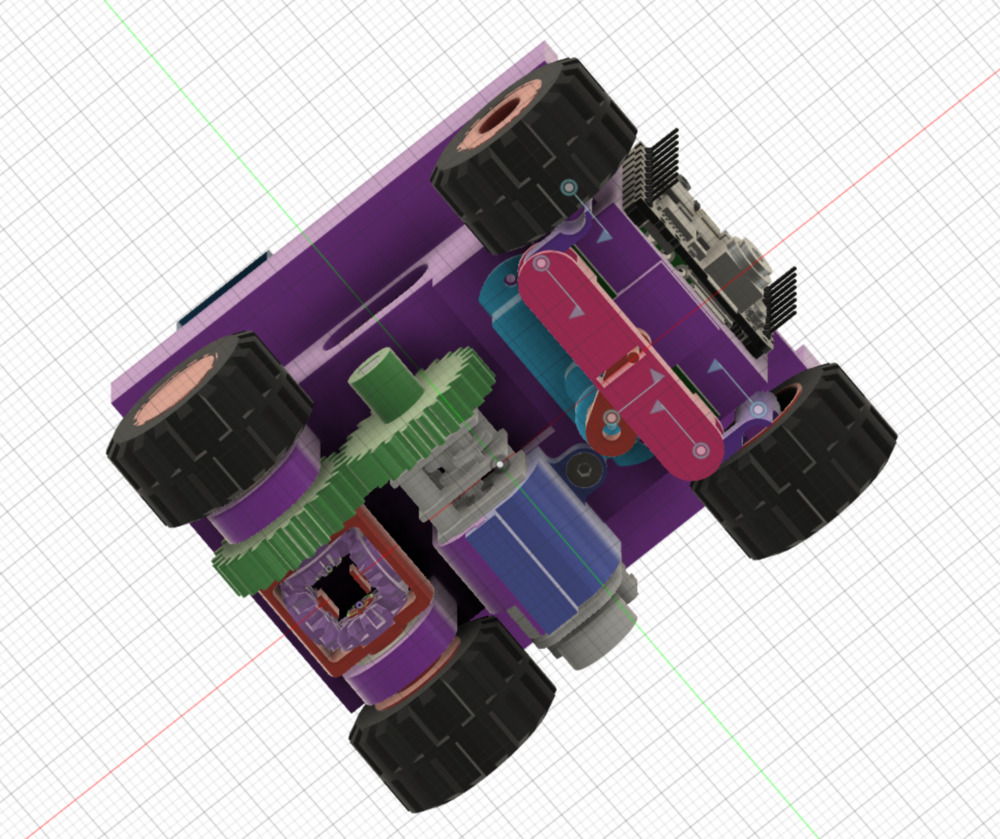
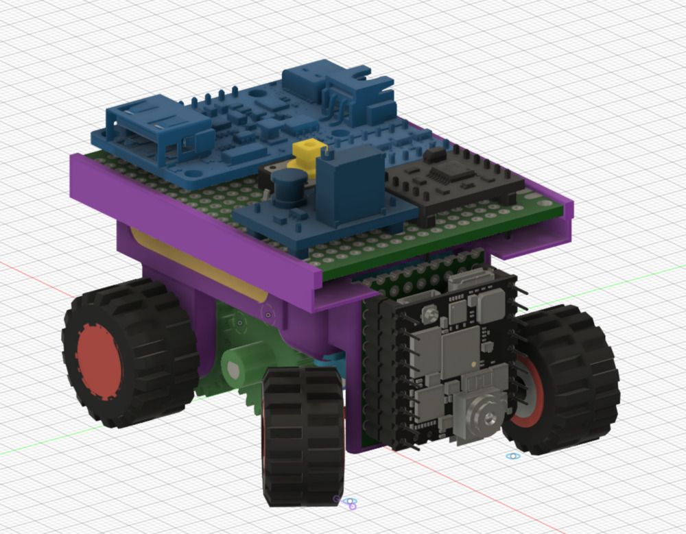
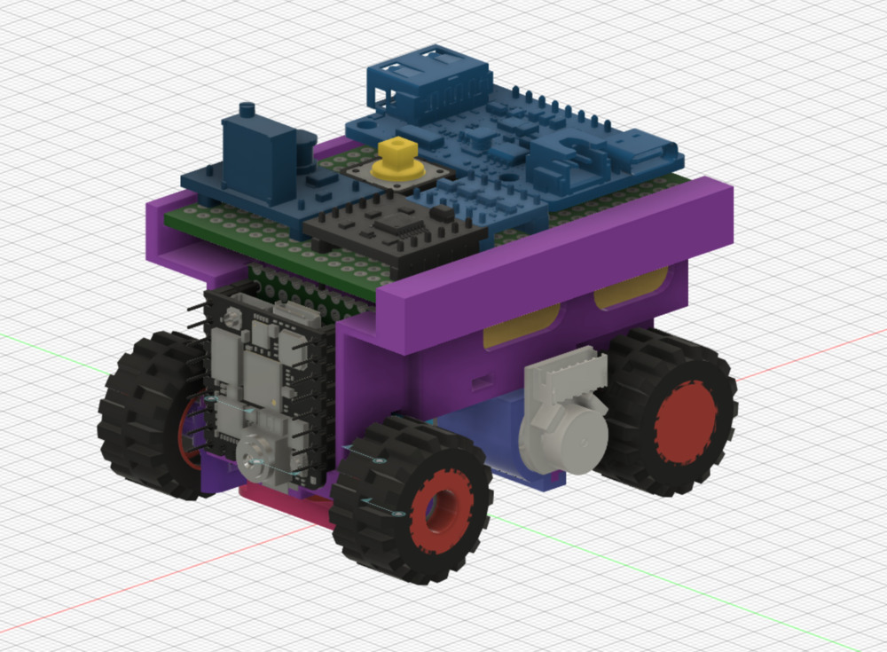
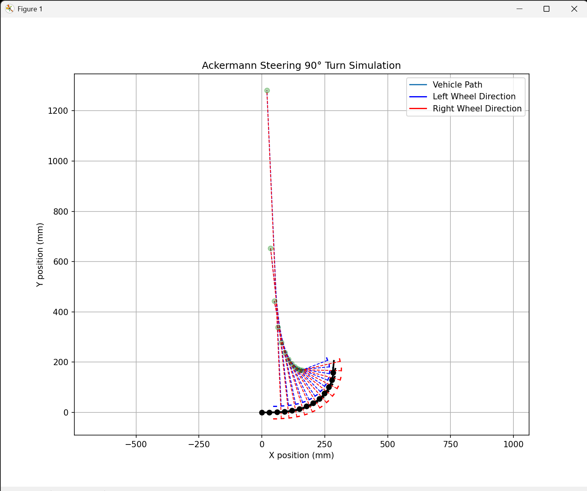

# Other Resources

This folder contains supplementary materials for Team ANTi’s WRO 2025 Future Engineers robot, including datasheets, communication protocols, and other documentation. This documentation was last updated on **Thursday, May 29, 2025, at 10:57 PM +03**.

## Resource List
- `stm32h747_datasheet.pdf`: Microcontroller specifications.  
  
- `gc2145_datasheet.pdf`: Camera sensor details.  
  
- `vl53l1x_datasheet.pdf`: ToF sensor specifications.  
  
- `lsm6dsox_datasheet.pdf`: IMU specifications.  
  
- `fs0307_datasheet.pdf`: Servo motor details.  
  
- `drv8833_datasheet.pdf`: Motor driver specifications.  
  
- `n20_motor_datasheet.pdf`: N20 motor and encoder details.  
  
- `lipo_rider_plus_manual.pdf`: Charger/booster documentation.  
  
- `sx1308_datasheet.pdf`: Voltage booster specifications.  
  
- `bob12009_datasheet.pdf`: Logic level converter details.  
  
- `px103035_battery_specs.pdf`: Battery specifications.  
  
- `communication_protocol.md`: Details on I2C/SPI protocols used for sensor communication.
- `motor_speed_calculations.jpg`: Motor speed calculations for selecting the 1500 RPM N20 motor based on wheel/tires sizes and the 3m x 3m game field.  
  
- `image_processing_setup.jpg`: Setup for image processing.  
  
- `obstacle_challenge_strategy_1.jpg`: Strategy diagram 1.  
  
- `obstacle_challenge_strategy_2.jpg`: Strategy diagram 2.  
  
- `design_to_life.jpg`: Design inspiration.  
  
- `soldering_setup.jpg`: Soldering setup for pertinax boards.  
  
- `example_detection.jpg`: Example detection image.  
  
- `KLS7-TS1204.jpg`: Tactile switch image.  
  
- `transparent_only_logo_WRO2025_FE_ANTi_logo_05-05-2025.png`: Team ANTi logo.  
  
- `CAD_fusion_bottom_view.jpg`: CAD rendering of the bottom view.  
  
- `CAD_fusion_left_view.jpg`: CAD rendering of the left view.  
  
- `CAD_fusion_right_view.jpg`: CAD rendering of the right view.  
  
- `lego87697_wheel_comparison.jpg`: Comparison image for LEGO 87697 tire selection.  
  
- `ANTi_wro_sim.png`: Simulation image from Webots, converted to physical work due to timeline constraints.  
  
- `ackermann_steering_path.png`: Simulation of Ackermann steering path for a 90-degree turn.  
  

## Notes
- All datasheets are sourced from official manufacturer websites.
- Communication protocols are optimized for low latency and reliability.
- The Webots simulation (`ANTi_wro_sim.png`) was initially developed as a universal simulation but was converted directly into physical work due to timeline constraints.
- Follow our progress on 📸 [Instagram](https://www.instagram.com/anti.wro) and 🎥 [YouTube](https://www.youtube.com/@solipsy.).

For hardware details, see [Schemes Documentation](../schemes/README.md).