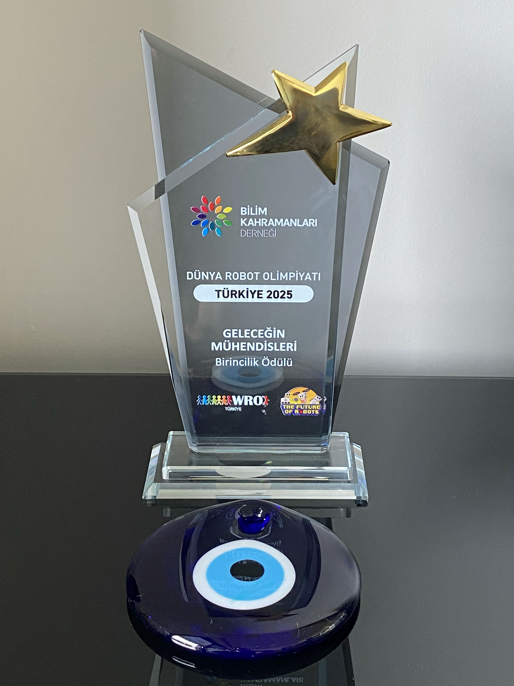

# Other Resources

This folder contains supplementary materials for Team ANTi's WRO 2025 Future Engineers robot, including component images, technical documentation, development photos, and design resources. This documentation was last updated on **Saturday, November 08, 2025, at 08:23 AM +03**.

## Resource Categories

### Electronic Components
| Component | Image | Description |
|-----------|-------|-------------|
| STM32H747 |  | Dual-core camera microcontroller |
| nRF52832 |  | Sensor microcontroller for sensor computations |
| GC2145 Camera |  | 2MP CMOS camera with 80° view angle |
| VL53L1X ToF |  | ToF sensor with 400cm range, full FoV |
| VL53L3CX ToF |  | ToF sensor with 700cm range, narrow FoV window lens |
| LSM6DSOX IMU |  | 6-axis accelerometer and gyroscope IMU |
| DRV8833 |  | PWM motor driver |
| BOB-12009 |  | 3.3V–5V logic level converter |
| SX1308 |  | 2A DC-DC Step-Up voltage booster |

### Movement & Power Components
| Component | Image | Description |
|-----------|-------|-------------|
| N20 Motor |  | 1500 RPM DC motor with Hall effect magnetic encoder |
| FS0307 Servo |  | Feetech submicro servo motor |
| LEGO 87697 |  | Tire selection comparison showing advantages |
| PX103035 Battery |  | Power-Xtra 1000mAh LiPo battery with PCM |
| LiPo Rider Plus |  | USB-C charger/booster with power switch |
| KLS7-TS1204 |  | Tactile switch for start action |

### Design & Development
| Resource | Image | Description |
|----------|-------|-------------|
| Ackermann Steering |  | Simulation of steering path for 90-degree turn |
| Motor Calculations |  | Calculations for motor selection based on requirements |
| ToF Window Lens |  | Dimensions and specifications of the ToF window lens used for narrower FoV |
| Webots Simulation |  | Simulation concept (converted to physical implementation) |

### Branding & Achievements
| Resource | Image | Description |
|----------|-------|-------------|
| Team Logo |  | Official Team ANTi competition logo |
| Champion Trophy |  | Turkish National Champion achievement |

## Experienced Problems and Implemented Solutions
During the development of the WRO 2025 robot, we encountered several challenges, including:

1. **Integration Issues**: Difficulty in integrating various electronic components due to compatibility issues was resolved by selecting standardized components that are widely supported.

2. **Power Management**: A critical issue was discovered where the 3.3V rail remained active even when the system was off, risking battery drain. This was resolved by performing a hardware modification to the LiPo Rider Plus, rewiring its LDO regulator to the switched 5V rail.

3. **Sensor Calibration**: Initial sensor readings were inconsistent. We implemented a systematic calibration routine to ensure accuracy across all sensors.

4. **Mobility Constraints**: The robot experienced mobility issues on uneven terrain. We redesigned the chassis to improve stability and traction.

## Notes
- All component specifications are sourced from official manufacturer datasheets.
- Development photos showcase our hands-on manufacturing and testing processes.
- Simulation assets demonstrate our comprehensive design validation approach.
- Custom calculations and comparisons guide our engineering decisions.

## Technical Documentation
For detailed documentation, please refer to the following resources:
- **[Schemes Documentation](../schemes/README.md)**: Contains component datasheets, custom pertinax board manufacturing docs, thermal analysis, and power distribution schematics.
- **[Models Documentation](../models/README.md)**: Includes hardware specifications and mechanical design files.
- **[Software Documentation](../src/README.md)**: Features communication protocols (including optimized UART) and software implementation details.

Follow our competition journey: 📸 [Instagram](https://www.instagram.com/anti.wro/) • 🎥 [YouTube](https://www.youtube.com/@solipsy.)