# Schemes Documentation

This folder contains the complete electrical schematics, wiring diagrams, and power management documentation for Team ANTi's WRO 2025 Future Engineers robot. All electronic systems were designed, manufactured, and assembled by our team using custom pertinax boards to achieve optimal performance in the world's smallest autonomous vehicle. This documentation was last updated on **Saturday, November 08, 2025, at 06:41 PM +03**.

## 🎯 Electrical Design Philosophy

Our electrical design philosophy emphasizes **modularity, maintainability, and hands-on engineering excellence**. By choosing custom pertinax board construction over professionally manufactured PCBs, we achieved complete control over the manufacturing process while developing essential engineering skills through practical implementation.

## 📋 Complete Bill of Materials (BOM)

| Component | Image | Quantity | Type | Description |
|-----------|-------|----------|------|-------------|
| STM32H747 | 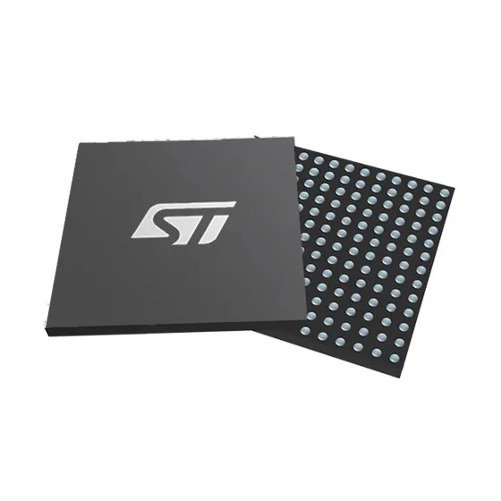 | 1 | Camera Microcontroller | Dual-core high-performance microcontroller for vision processing |
| nRF52832 | 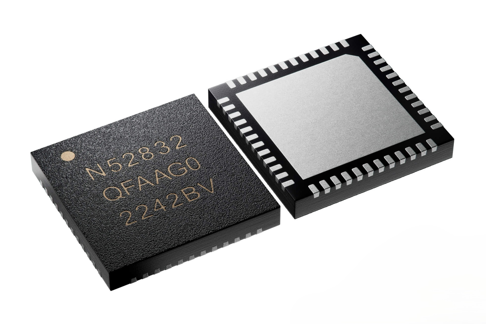 | 1 | Sensor Microcontroller | Handles sensor computations and data processing |
| GC2145 Camera | 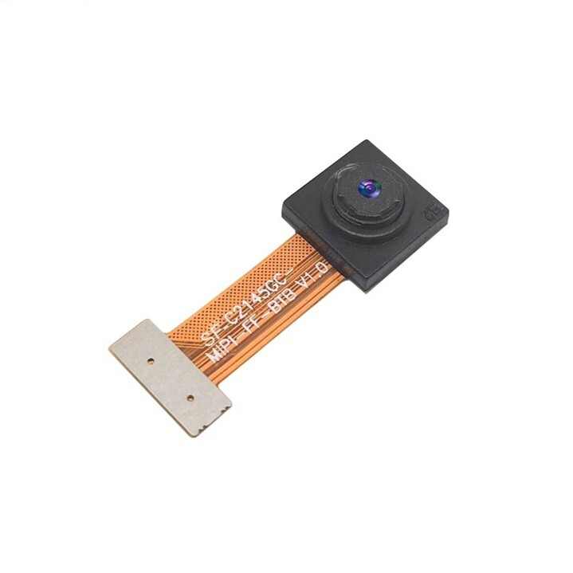 | 1 | 2MP Camera | 2MP CMOS camera, 2.2mm focal length, 80° view angle |
| VL53L1X ToF |  | 1 | ToF Sensor | 400cm range, full FoV - used for front detection |
| VL53L3CX ToF | 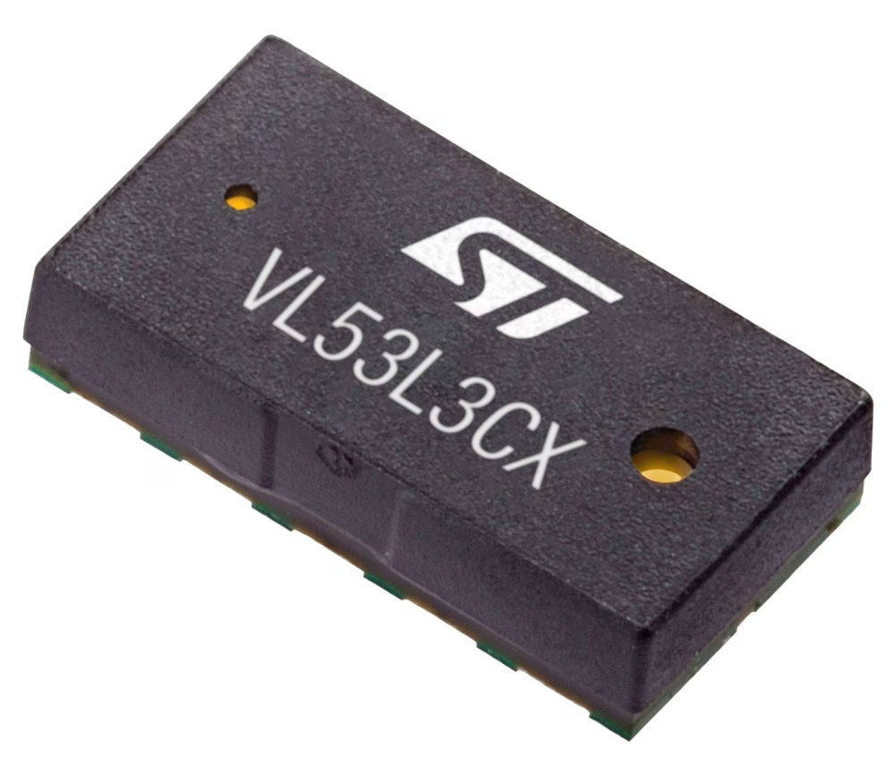 | 2 | ToF Sensor | 700cm range, narrow FoV with window lens - used for side detection |
| LSM6DSOX IMU | 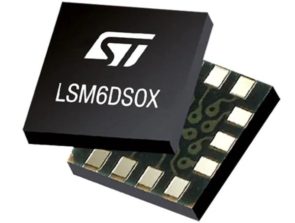 | 1 | 6-axis IMU | Accelerometer and gyroscope for navigation |
| DRV8833 Driver |  | 1 | Motor Driver | PWM motor driver for DC motor control |
| BOB-12009 | 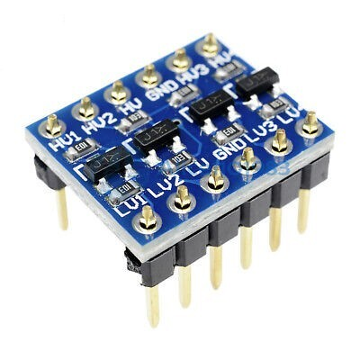 | 1 | Logic Level Converter | 3.3V–5V bidirectional voltage conversion |
| SX1308 Booster | 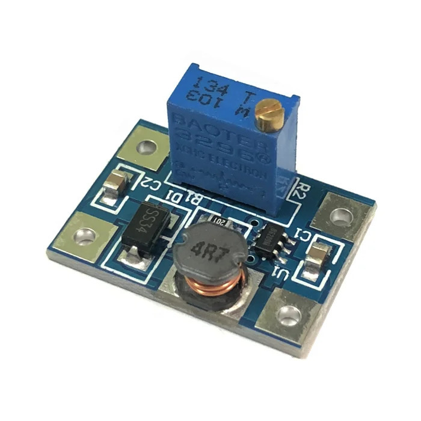 | 1 | Voltage Booster | 2A DC-DC step-up converter for motor power |
| Feetech FS0307 | 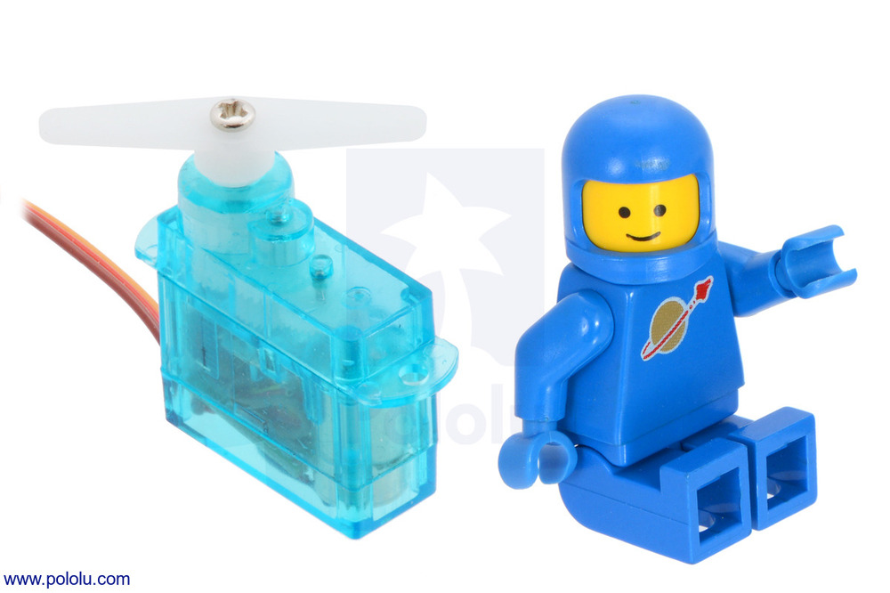 | 1 | Servo Motor | Submicro servo for steering mechanism |
| 1500 RPM N20 | 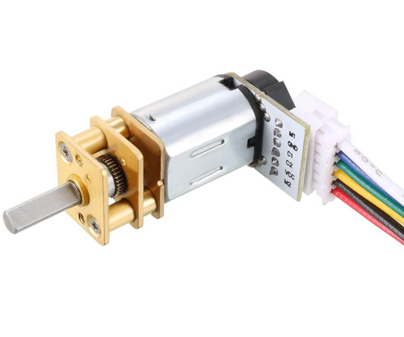 | 1 | DC Motor + Encoder | Brushed DC motor with Hall effect encoder |
| Power-Xtra PX103035 | 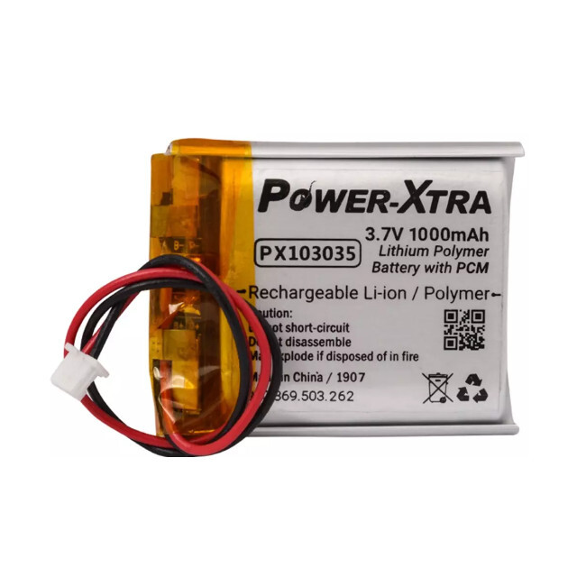 | 1 | LiPo Battery | 3.7V 1000mAh battery with PCM protection |
| LiPo Rider Plus | 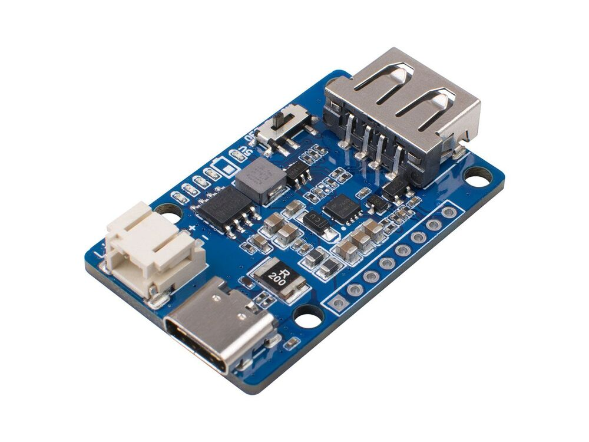 | 1 | Charger/Booster | USB-C power management with switching |
| KLS7-TS1204 | 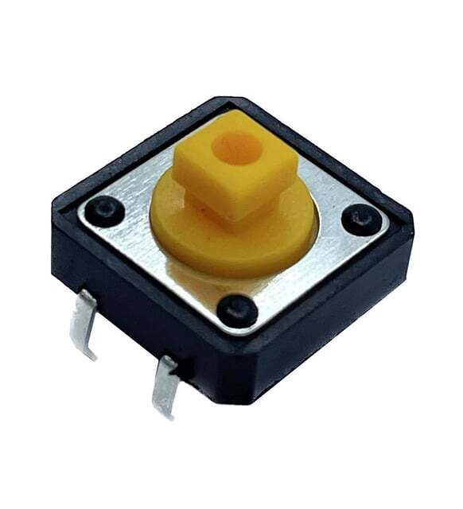 | 1 | Tactile Switch | Start action initiation button |
| LEGO 87697 | 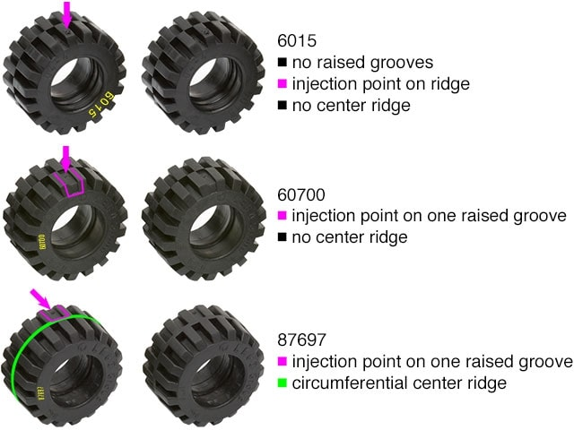 | 4 | Tire | 21mm diameter, 12mm width with center ridge |

**Component Sourcing Philosophy**: No direct product links or prices are provided to maintain universal accessibility and prevent outdated information. All components are easily searchable online using the provided names and images, with authenticity verifiable through the datasheets in this repository.

## 🔌 Complete Wiring System

### Master Wiring Schematic & Physical Implementation

  
  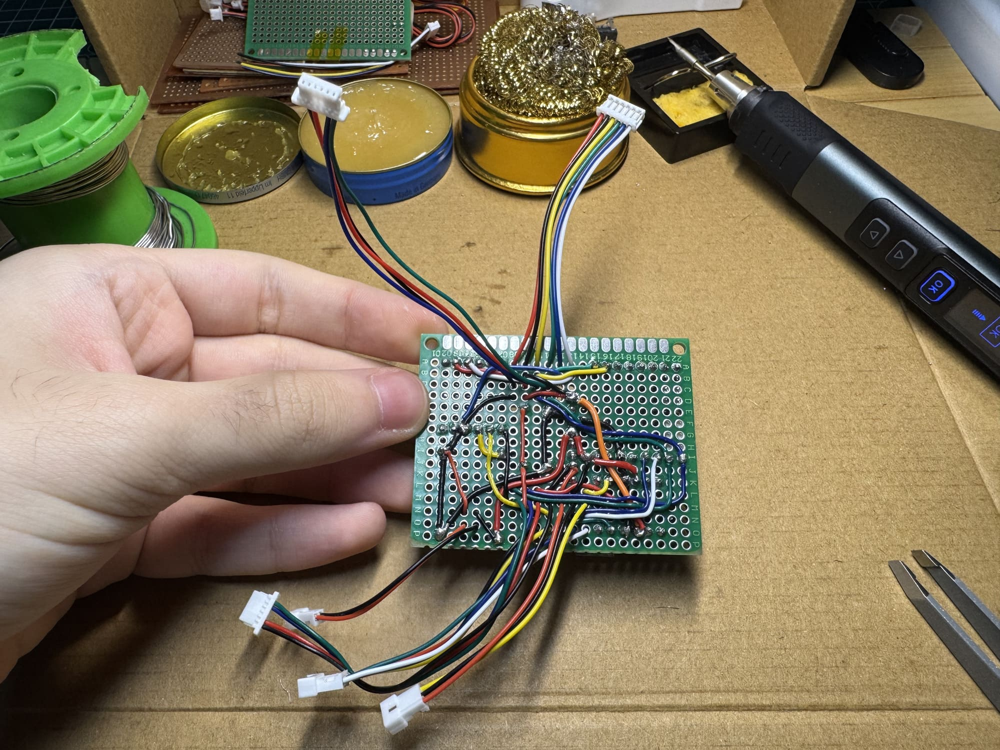

  <em>1) Complete hand-drawn and digitally traced professional wiring schematic showing all electrical connections (<a href="wiring_diagram.jpg" target="_blank">view full resolution</a>) • 2) Physical implementation demonstrating socket-based construction of the schematic</em>

**Engineering Documentation Excellence**:
- **Professional Schematic**: Every connection meticulously documented with color-coded wiring traces
- **Socket-Based Architecture**: All components use removable sockets for easy maintenance and testing
- **Cable Management**: Strategic routing through multiple pertinax holes prevents stress points by distributing cable stress and minimizing bending at any single point, ensuring long-term reliability
- **Visual Verification**: Direct correlation between schematic and physical implementation

**Cable Management**:

The cable management strategy was specifically designed to prevent socket cables from bending excessively and causing breakpoints or connection issues, we implemented a strategic cable routing approach. Each cable passes through two different pertinax holes, distributing stress and minimizing bending at any single point, ensuring long-term reliability.

## ⚡ Power Management System

### Power Distribution Architecture

**Multi-Rail Power System**:
- **+3V3 Rail**: Primary power for microcontrollers, sensors, and ToF sensors (STM32H747, nRF52832, VL53L3CX)
- **+5V Rail**: Servo power (Feetech FS0307) and SX1308 booster input
- **+6V Rail**: DC motor power through SX1308 booster (1500 RPM N20 motor)
- **+2V8 Rail**: Powers the GC2145 camera and VL53L1X ToF sensor
- **+1V8 Rail**: Low-power analog components (LSM6DSOX IMU)

### Power Consumption Analysis

**Battery Performance Specifications**:
- **Capacity**: 1000mAh 3.7V LiPo with PCM protection
- **Run Time**: 4–5 hours under typical operational load
- **Charge Time**: ~45 minutes via USB-C at 10W (2A) maximum input
- **Calculation Basis**: Run time = Battery Capacity (mAh) / Total System Current (mA)

**Power Consumption Breakdown**:
| Component | Voltage | Typical Current | Peak Current | Power Consumption |
|-----------|---------|----------------|--------------|-------------------|
| STM32H747 | 3.3V | 25 mA | 80 mA | 83 mW - 264 mW |
| nRF52832 | 3.3V | 4 mA | 10 mA | 13 mW - 33 mW |
| GC2145 Camera | 2.8V | 25 mA | 60 mA | 70 mW - 168 mW |
| VL53L1X ToF | 2.8V | 10 mA | 20 mA | 28 mW - 56 mW |
| VL53L3CX ToF (x2) | 3.3V | 12 mA each | 25 mA each | 79 mW - 165 mW |
| LSM6DSOX IMU | 1.8V | 0.5 mA | 1.2 mA | 0.9 mW - 2.2 mW |
| Feetech FS0307 Servo | 5V | 3 mA (idle) | 100 mA (stall) | 15 mW - 500 mW |
| SX1308 Booster Input | 5V | 40 mA | 200 mA | 200 mW - 1500 mW |
| 1500 RPM N20 Motor | 6V | 30 mA | 250 mA | 180 mW - 1500 mW |
| **Total System** | **Mixed** | **~120 mA** | **~500 mA** | **~0.5W - 2.5W** |

**Operational Power Validation**: 
- **Typical Operation**: 0.5W - 1.2W during normal autonomous navigation
- **Peak Operation**: 1.8W maximum observed during intensive processing and motor activity
- **Measurement Method**: USB-C power meter confirmation of calculated estimates

## 🔧 Custom Manufacturing Philosophy

### Why Pertinax Over Professional PCBs

  
  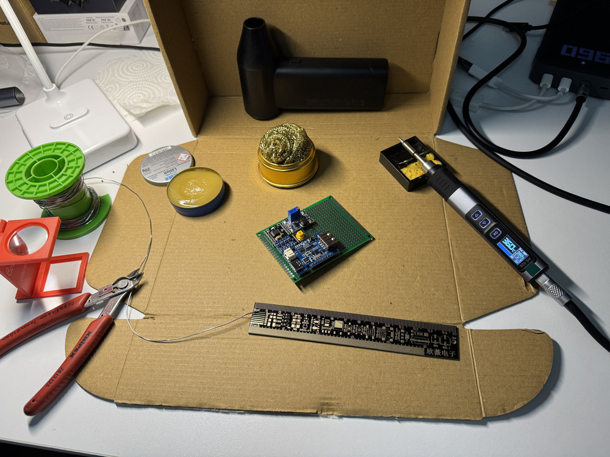

  <em>1) Pertinax boards before custom shaping • 2) Complete soldering setup used for all custom manufacturing</em>

**Strategic Engineering Choice Analysis**:

| Aspect | Professional PCB | Custom Pertinax | Our Rationale |
|--------|------------------|-----------------|---------------|
| **Development Speed** | 1-2 weeks turnaround | Instant modifications | Rapid prototyping and iterative improvement |
| **Cost Efficiency** | $5-$25 per iteration | <$5 total material cost | Budget-friendly for student teams |
| **Design Flexibility** | Fixed once manufactured | Adjustable in minutes | Accommodates component changes |
| **Skill Development** | Limited hands-on experience | Comprehensive soldering and circuit design | Essential engineering skill building |
| **Maintenance** | Difficult component replacement | Easy socket-based swapping | Competition-ready serviceability |
| **Control** | Outsourced manufacturing | Complete in-house control | Understanding every connection |

**Socket-Based Design Advantages**:
- **Component Testing**: Individual modules can be tested independently
- **Field Repairs**: Quick replacement during competition without soldering
- **Upgrade Path**: Easy component upgrades as technology evolves
- **Educational Value**: Visual understanding of circuit relationships

## 🎯 Component-Specific Engineering

### Microcontroller Systems

  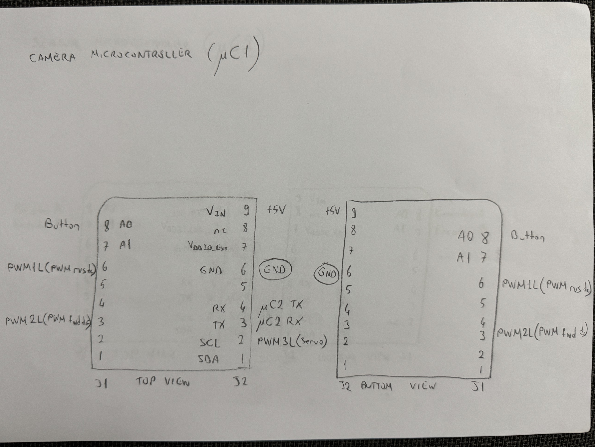
  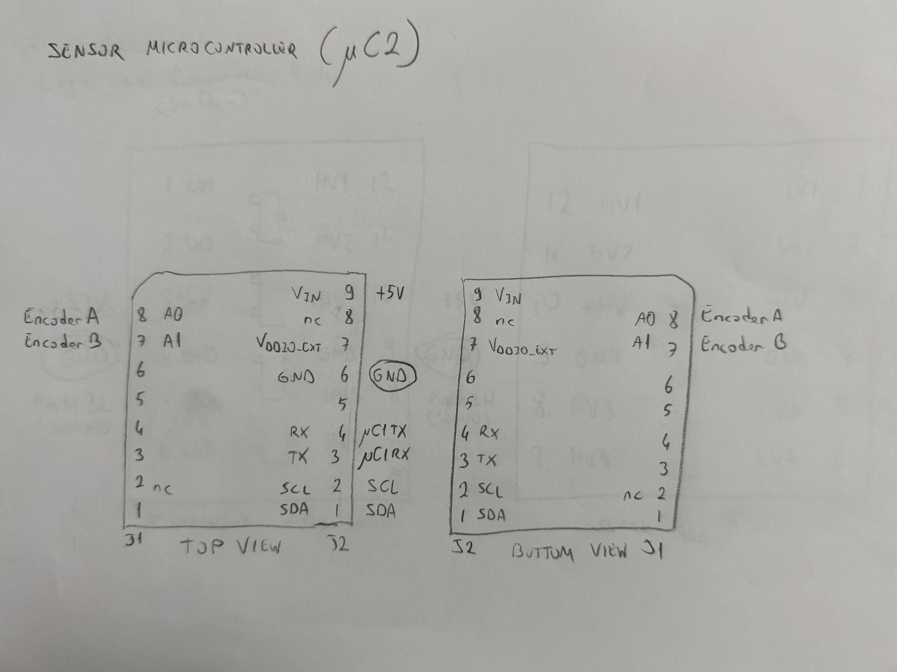

  <em>1) STM32H747 camera microcontroller with peripheral connections • 2) nRF52832 sensor microcontroller interface details</em>

**STM32H747 Camera Microcontroller**:
- **Architecture**: Dual-core Cortex-M7/M4 for parallel vision and control processing
- **Connectivity**: Dedicated camera interface (DCMI) for GC2145, multiple UART/I2C for sensors
- **Power Management**: Separate 3.3V rail with decoupling capacitors for stable operation
- **Integrated Power Regulation**: Built-in 1.8V and 2.8V rails generated on the STM32 evaluation board for camera and sensor peripherals

**nRF52832 Sensor Microcontroller**:
- **Role**: Dedicated sensor fusion and real-time data processing
- **Communication**: I2C for ToF sensors, UART to STM32H747
- **Efficiency**: Low-power operation for extended battery life

### Vision System: GC2145 Camera

**Technical Specifications**:
- **Resolution**: 2MP (1600×1200) for detailed track detection
- **Optics**: 2.2mm focal length with 80° diagonal field of view
- **Distortion**: <1.0% barrel distortion for accurate line following
- **Interface**: DCMI parallel interface to STM32H747
- **Power**: 2.8V analog core with 3.3V digital I/O

**Performance Features**:
- **Low-Light Capability**: Enhanced sensitivity for competition lighting variations
- **Frame Rate**: Configurable up to 30fps for real-time processing
- **Integration**: Direct connection to STM32H747 DCMI interface without intermediate conversion

### Time-of-Flight Sensor System

**ToF Sensor Power Distribution**:
- **VL53L1X**: Powered from +2V8 rail (front sensor)
- **VL53L3CX**: Powered from +3V3 rail (side sensors with window lenses)

#### ToF Sensor Comparison & Selection

  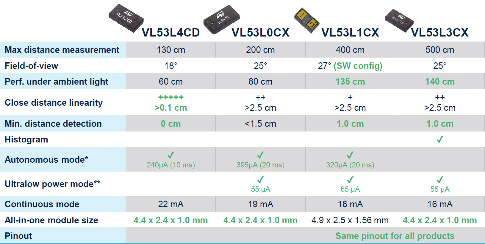
  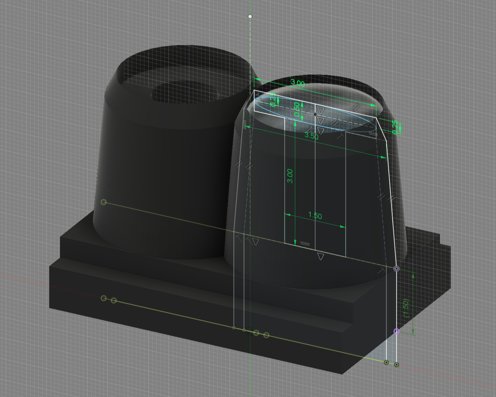

  <em>1) VL53L1CX vs VL53L3CX performance comparison showing detailed specifications • 2) Dimensions and specifications of the ToF window lens used for narrower FoV optimization</em>

**Technical Specification Comparison**:

| Parameter | VL53L1CX (Front) | VL53L3CX (Sides) |
|-----------|------------------|-----------------|
| **Max Distance** | 400 cm | 500 cm |
| **Field of View** | 27° (software configurable) | 25° (fixed) |
| **Ambient Light Performance** | 135 cm | 140 cm |
| **Close Distance Linearity** | +>2.5 cm | ++>2.5 cm (improved) |
| **Minimum Distance** | 1.0 cm | 1.0 cm |
| **Histogram Processing** | No | Yes (advanced filtering) |
| **Autonomous Mode** | Yes, 320 μA @20ms | No |
| **Ultra-low Power** | 65 μA | 55 μA |
| **Continuous Mode** | 16 mA | 16 mA |
| **Sensor Size** | 4.9×2.5×1.56 mm | 4.4×2.4×1.0 mm |
| **Pin Compatibility** | Identical pinouts | Identical pinouts |

**Sensor Selection Rationale**: VL53L1CX chosen for front detection with configurable FoV, while VL53L3CX selected for side detection benefiting from longer range and decreased FoV with window lenses compatible with VL53L3CX sensor dimensions and optics, achieving even narrower field of view for improved accuracy in challenging conditions.

#### Field of View Engineering Challenge

  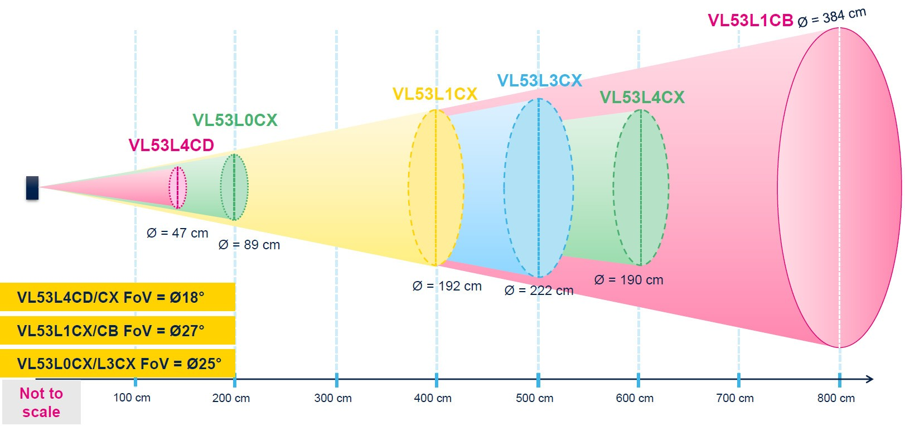

  <em>Field of view analysis showing ground intersection problem at extended ranges</em>

**Problem Identification**:
- **Ground Intersection**: At medium ranges, FoV cones intersect with ground surface
- **VL53L1CX**: 192cm diameter at 400cm range (27° FoV)
- **VL53L3CX**: 222cm diameter at 500cm range (25° FoV)
- **Robot Constraints**: Minimal height (57mm) forces low sensor mounting

**Engineering Solutions**:
1. **Angular Adjustment**: Sensors mounted with slight upward tilt to increase ground intersection distance
2. **Window Lens Implementation**: Window lenses reduce effective FoV for longer clear detection
3. **Threshold Optimization**: Software filters for reliable object detection beyond ground interference

**Result**: Extended usable detection range from ~150cm to ~300cm for side sensors

### Motor Control Systems

  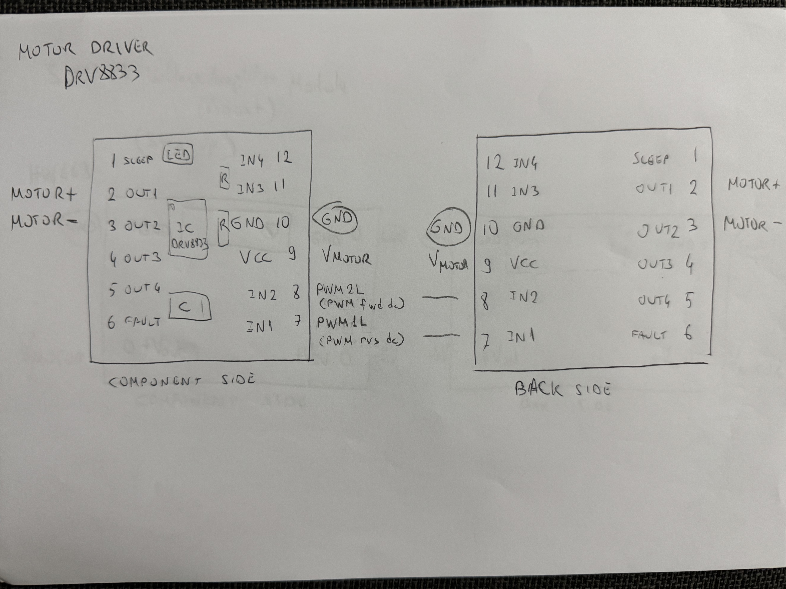
  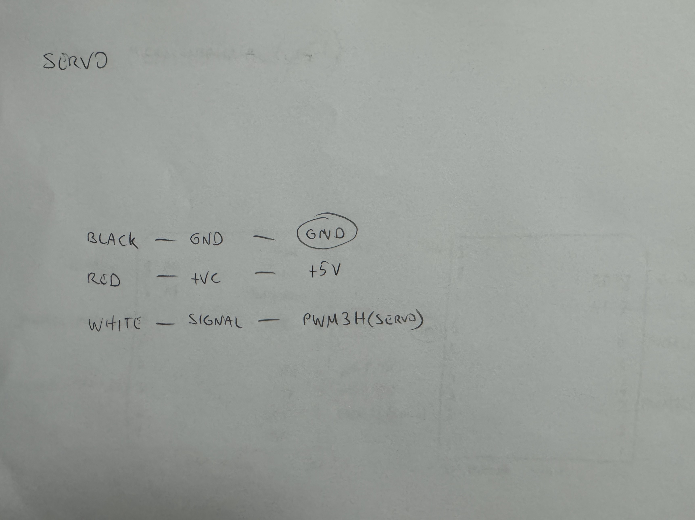

  <em>1) DRV8833 motor driver with SX1308 voltage boosted input • 2) Feetech FS0307 servo with logic level conversion</em>

**DC Motor Drive System**:
- **Motor Specification**: 1500 RPM N20 DC motor with Hall effect magnetic quadrature encoder
- **Voltage Optimization**: SX1308 booster provides stable 6V to motor driver for consistent performance
- **Logic Level**: DRV8833 operates with 3.3V control signals from microcontroller
- **Power Architecture**: SX1308 receives 5V input and provides 6V output to motor driver
- **Speed Calculation**: 
  - Gear Reduction: 26:25 ratio through custom spur gear design
  - Wheel RPM: 1500 × (26/25) = 1560 RPM
  - Theoretical Maximum Speed: 1.72 m/s with 21mm diameter wheels
  - Operational Speed: 1.4 m/s via PWM control for optimal stability

**Servo Control System**:
- **Logic Level Conversion**: BOB-12009 converts 3.3V microcontroller signals to 5V servo requirements
- **Precision Control**: PWM signal conditioning for accurate Ackermann steering positioning
- **Power Isolation**: Separate power rail prevents servo noise affecting sensitive sensors

### Power Management Components

  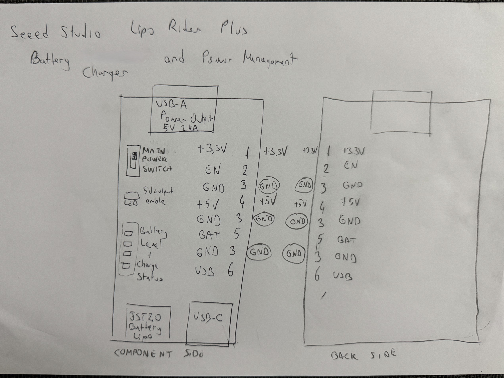
  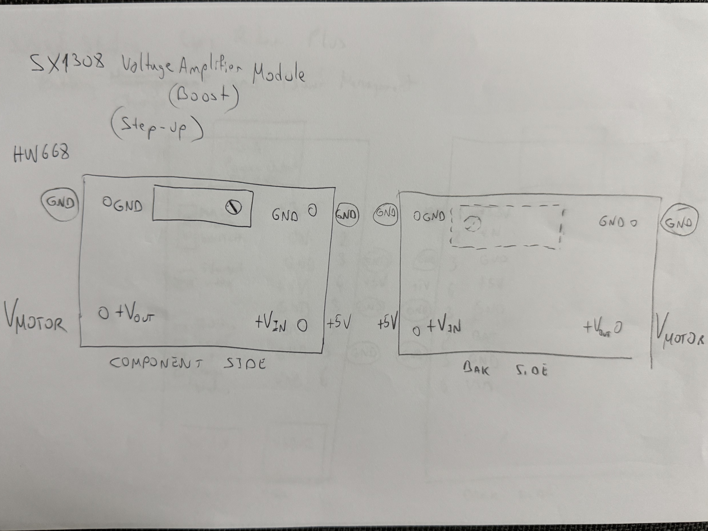

  <em>1) LiPo Rider Plus charging and distribution system • 2) SX1308 voltage booster for motor power</em>

**LiPo Rider Plus Power Management**:
- **Charging**: USB-C input with 2A maximum charging current
- **Power Switching**: Integrated switch controls all power rails after modification
- **Battery Protection**: PCM integration for over-current and over-discharge protection

**SX1308 Voltage Booster**:
- **Input**: 5V from LiPo Rider Plus
- **Output**: Stable 6V for DC motor operation
- **Current Capacity**: 2A maximum supporting motor peak demands
- **Efficiency**: >90% conversion efficiency minimizing power loss

## 🛠️ Engineering Challenges & Solutions

### Power Management Breakthrough

With our components selected, we faced significant challenges in power distribution and management. During development, we encountered a critical power management issue where the 3.3V rail remained active when system was switched off, causing battery drain.

**Root Cause Analysis**:
- LiPo Rider Plus power switch only controls 5V output
- 3.3V LDO regulator connected directly to battery voltage
- System drawing ~5mA even when "off"

While reading the datasheets, we discovered that the power switch on the LiPo Rider Plus only controls the 5V output. After diving deep into the component's schematic, we figured out that the 3.3V output was derived directly from the 3.7V battery connected to an LDO regulator (low-dropout regulator). Further research into the LDO specifications revealed that 5V input for the LDO is also applicable to receive optimal ~3.3V output.

**Innovative Hardware Solution**:
1. **Component Modification**: Desoldered unused USB-A input port
2. **LDO Reprogramming**: Lifted input pin from battery connection
3. **Insulation**: Kapton tape prevention of unwanted connections
4. **Rewiring**: Connected LDO input to switched 5V rail

Our solution involved desoldering the unused but mounted USB-A input of the LiPo Rider Plus, then lifting the LDO by desoldering the input pin from the battery voltage. We applied Kapton tape to prevent any unwanted electrical connections and soldered the LDO input to the 5V output directly from the USB-A's mounted pin. This innovative fix ensured that all power rails are controlled by the LiPo Rider Plus power switch.

  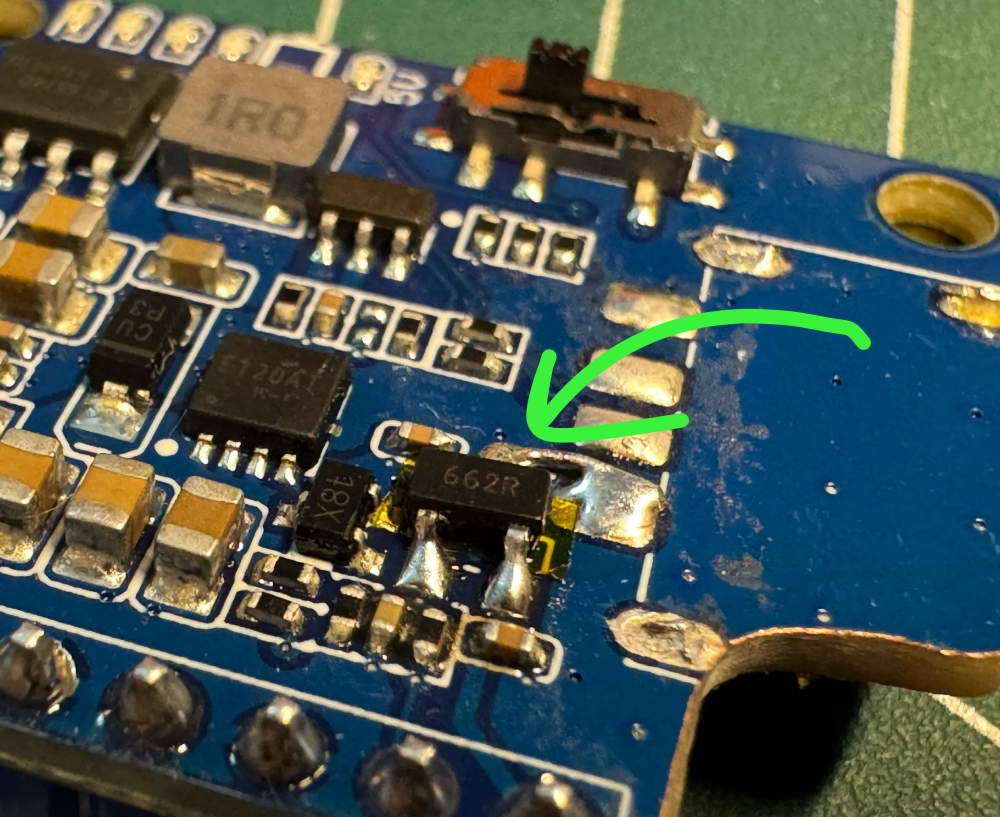

<em>Complete hardware modification ensuring all power rails are switch-controlled</em>

**Result**: True power-off state with zero battery drain, extending standby time indefinitely

### Thermal Management Validation

Although we thoroughly researched all datasheets and specifications, we conducted comprehensive thermal testing to ensure system reliability under extended operation. Our thermal analysis confirmed optimal operating temperatures across all critical components:

<table align="center">
<tr>
<td align="center">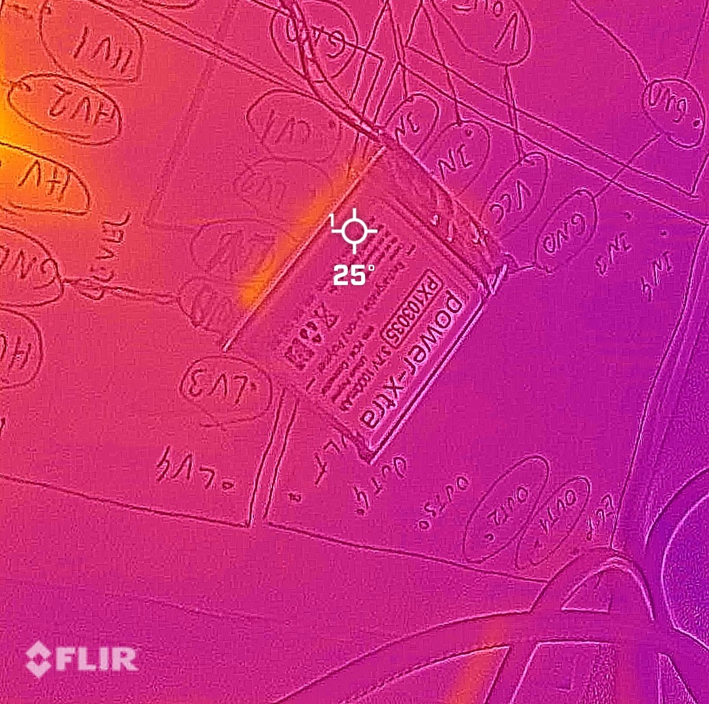 <strong>Battery: 25°C</strong></td>
<td align="center">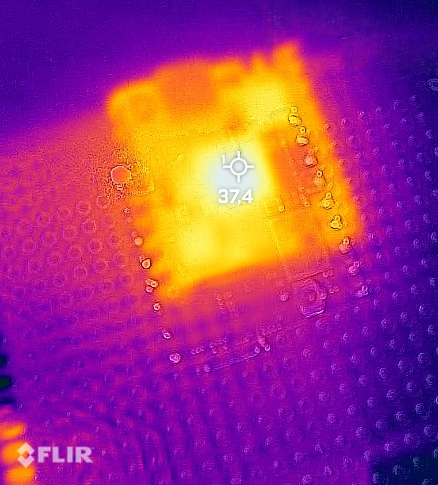 <strong>Microcontroller: 37°C</strong></td>
</tr>
<tr>
<td align="center">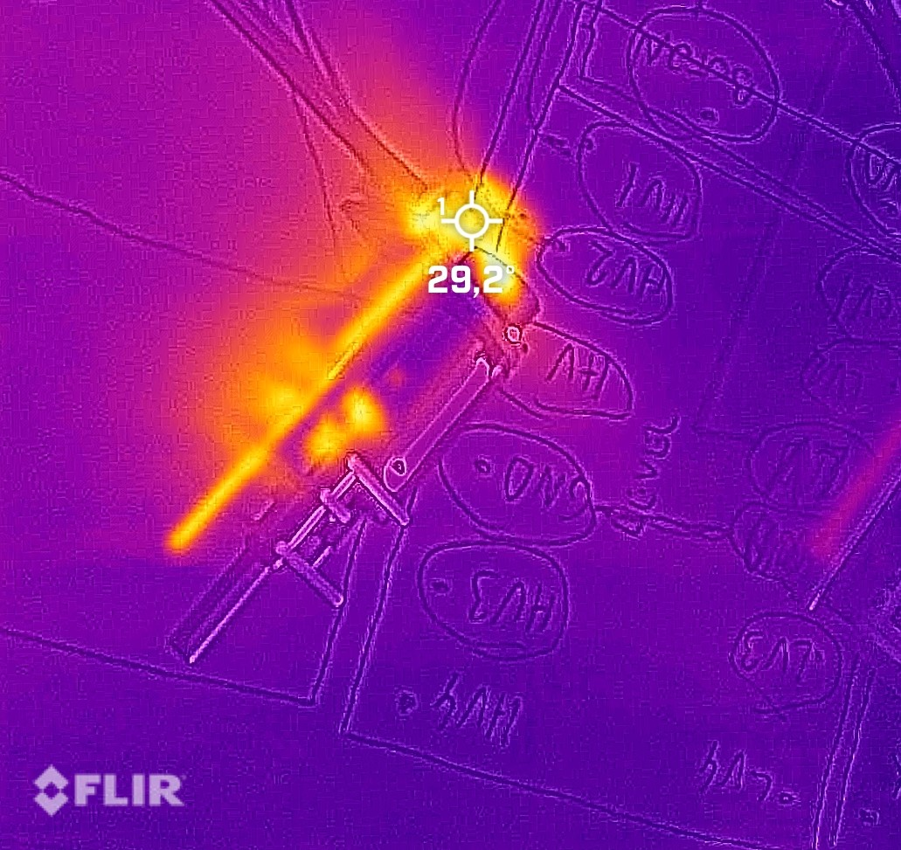 <strong>Motor: 29°C</strong></td>
<td align="center">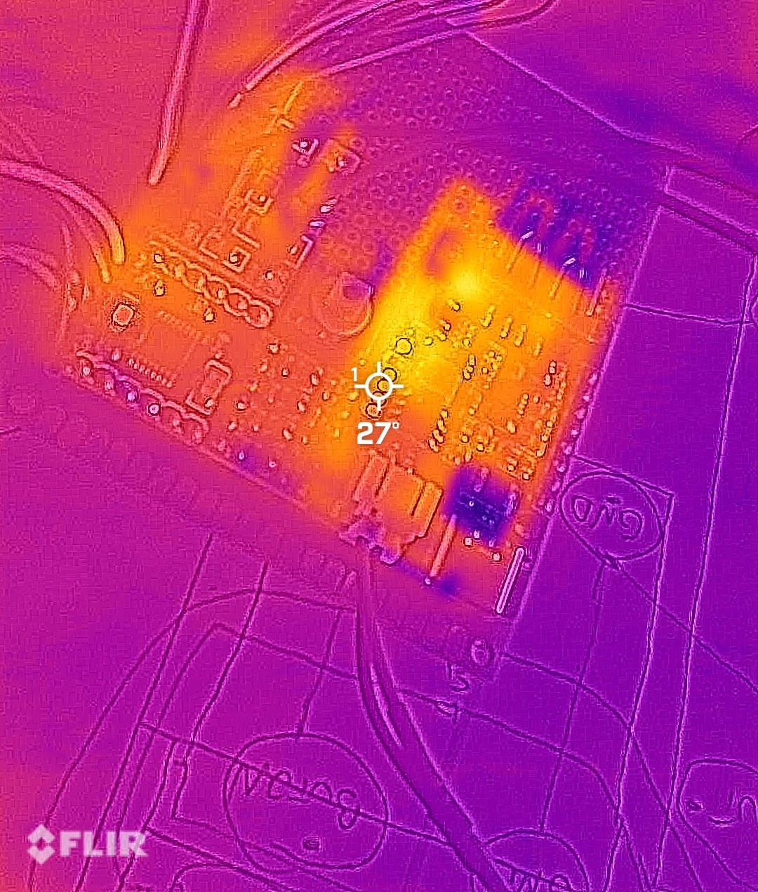 <strong>Power Management: 27°C</strong></td>
</tr>
</table>

<em>Infrared thermal imaging results demonstrating stable thermal performance during maximum operational load</em>

**Testing Methodology**:
- **Conditions**: Extended operation under maximum processing load
- **Measurement**: Infrared thermal imaging at component surfaces
- **Validation**: All temperatures within safe operating ranges
- **Margin**: Significant thermal headroom for competition conditions

**Key Findings**: All critical components operate well within safe temperature limits, with the highest temperature observed at the microcontroller (37°C) during intensive processing. The battery maintains a cool 25°C, confirming efficient power distribution and minimal heat generation throughout the system.

### Double-Layer Board Innovation

Our compact design required innovative board manufacturing solutions to fit all electronics within the minimal footprint. Facing extreme space constraints, we developed an innovative double-layered pertinax board solution inspired by multi-layer PCB manufacturing. We successfully managed to achieve a custom self-made double-layered pertinax connection on the same board, developing all our electronic boards using our own equipment instead of external manufacturing.

**This hands-on approach significantly enhanced our engineering knowledge and provided invaluable practical experience in custom board design and fabrication.**

  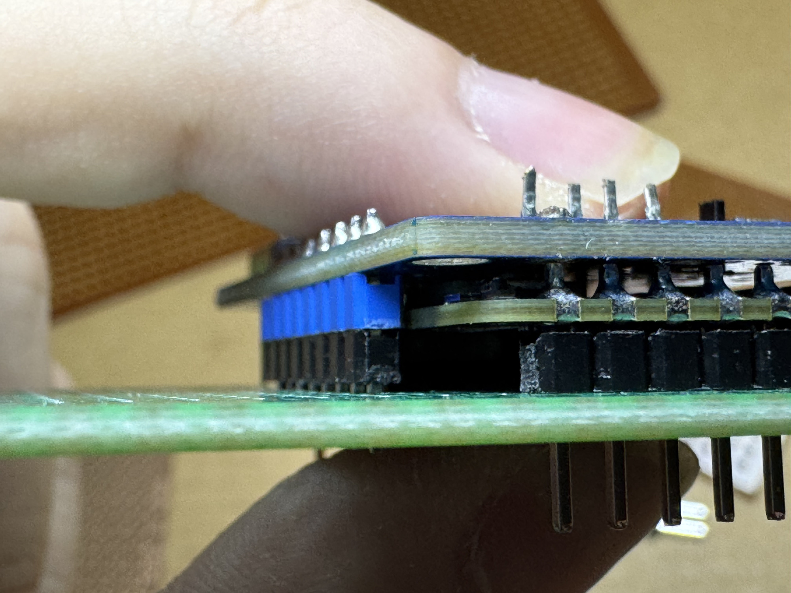

<em>Our custom self-made double-layered pertinax board with mounted second-layer components</em>

<table>
<tr>
<td width="60%">
To prevent potential short circuits and thermal issues between layers, we applied Kapton tape insulation on the bottom of top-layer components, ensuring reliable electrical isolation.  

**Space Optimization Strategy**:
- **Insulation Solution**: Kapton tape between layers prevents electrical contact
- **Structural Integrity**: Strategic component placement maintains board rigidity
- **Accessibility**: All test points and connections remain accessible
</td>
<td width="30%">
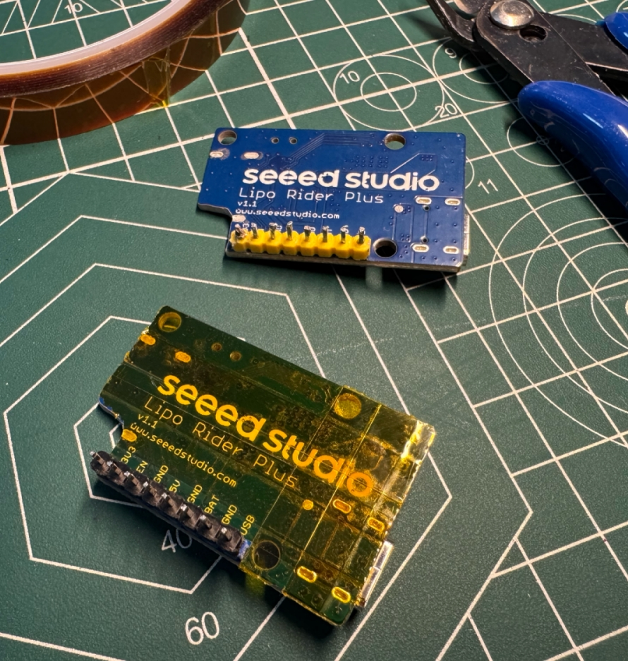

<em>Kapton tape insulation applied to prevent layer contact</em>

</td>
</tr>
</table>

## 🔌 Interface & Control Systems

  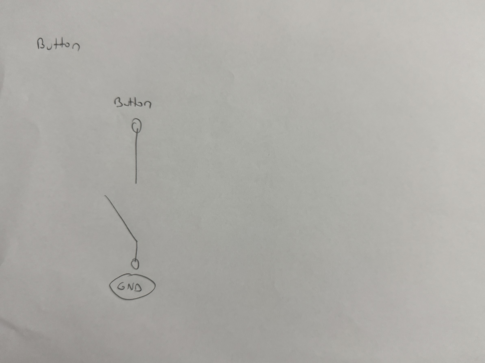
  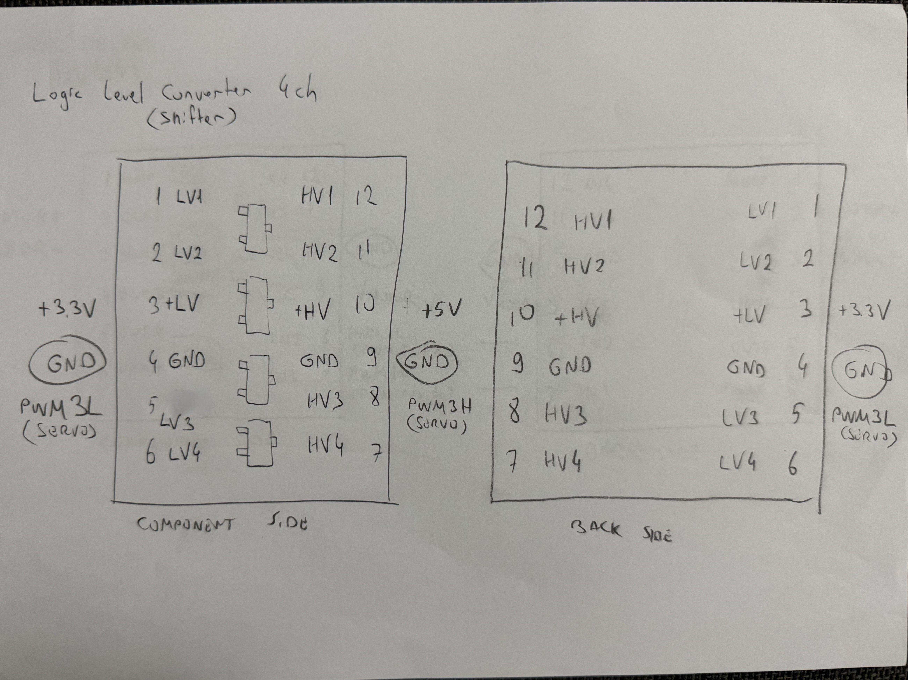

  <em>1) Tactile start button with direct connection to microcontroller • 2) BOB-12009 logic level converter implementation</em>

**User Interface**:
- **Start Mechanism**: KLS7-TS1204 tactile switch with direct pin-to-GND connection
- **Visual Feedback**: Software includes visual feedback and debounce logic
- **Safety**: Momentary action design helps prevent accidental operation. The switch is active low, meaning it triggers the mechanism when pressed, ensuring that operation only occurs during intentional activation.

**Signal Conditioning**:
- **Voltage Compatibility**: BOB-12009 ensures reliable 3.3V to 5V signal conversion for servo motor control
- **Noise Immunity**: Proper decoupling and signal integrity maintenance
- **Control Signal Support**: Facilitates effective control of the servo motor by ensuring proper voltage levels

## 📚 Datasheet References

All component specifications are thoroughly documented in the following datasheets:

| Component | Datasheet File | Key Specifications |
|-----------|----------------|-------------------|
| **BOB-12009 Logic Converter** | [BOB-12009.pdf](BOB-12009.pdf) | 3.3V-5V bidirectional conversion |
| **DRV8833 Motor Driver** | [drv8833.pdf](drv8833.pdf) | PWM motor control, current limiting |
| **Feetech FS0307 Servo** | [FS0307-specs.pdf](FS0307-specs.pdf) | Submicro size servo, torque specifications |
| **GC2145 Camera** | [GC2145.pdf](GC2145.pdf) | 2MP resolution, interface timing |
| **KLS7-TS1204 Switch** | [kls7-ts1204.pdf](kls7-ts1204.pdf) | Tactile button characteristics |
| **LiPo Rider Plus** | [LiPoRiderPlus_ETA9740_V1.1.pdf](LiPoRiderPlus_ETA9740_V1.1.pdf) | Charging IC specifications |
| **LiPo Rider Plus Schematic** | [LiPoRiderPlus_SCH.pdf](LiPoRiderPlus_SCH.pdf) | Board layout and connections |
| **LSM6DSOX IMU** | [lsm6dsox.pdf](lsm6dsox.pdf) | 6-axis motion tracking |
| **N20 Motor** | [N20_motors.pdf](N20_motors.pdf) | Motor and encoder specifications |
| **nRF52832 Microcontroller** | [nRF52832.pdf](nRF52832.pdf) | Pin interfaces that handle sensor computations |
| **STM32H747 Microcontroller** | [stm32h747.pdf](stm32h747.pdf) | Dual-core architecture, peripherals |
| **SX1308 Booster** | [SX1308.pdf](SX1308.pdf) | DC-DC step-up converter |
| **VL53L1X ToF Sensor** | [vl53l1x.pdf](vl53l1x.pdf) | 400cm range, full FoV operation |
| **VL53L3CX ToF Sensor** | [vl53l3cx.pdf](vl53l3cx.pdf) | 500cm range, with smaller FoV |

## ✅ Engineering Validation

This comprehensive electrical and schematic documentation provides complete transparency into our design process, component selection rationale, manufacturing methodology, and problem-solving approaches. Every aspect of our electrical system has been optimized for reliability, maintainability, and performance in the WRO 2025 Future Engineers competition.

**Documentation Completeness**: All schematics, wiring diagrams, component specifications, and implementation details are provided to enable exact replication of our electrical systems. This documentation aims to fulfill the WRO Future Engineers competition requirements for comprehensive engineering documentation through detailed electrical system transparency.

---

For mechanical design and 3D models: [Models Documentation](../models/README.md)  
For software implementation and algorithms: [Software Documentation](../src/README.md)  
For competition performance videos: [Video Documentation](../video/README.md)  
For additional resources and photos: [Other Documentation](../other/README.md)