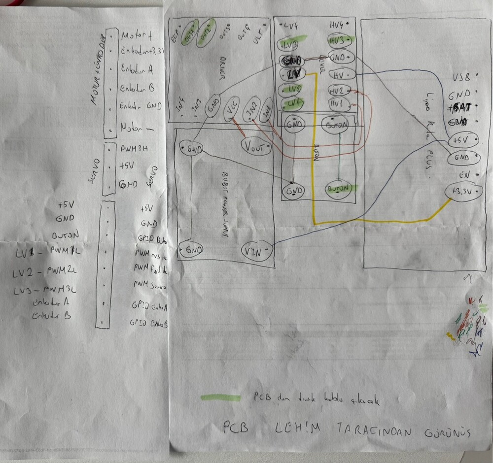
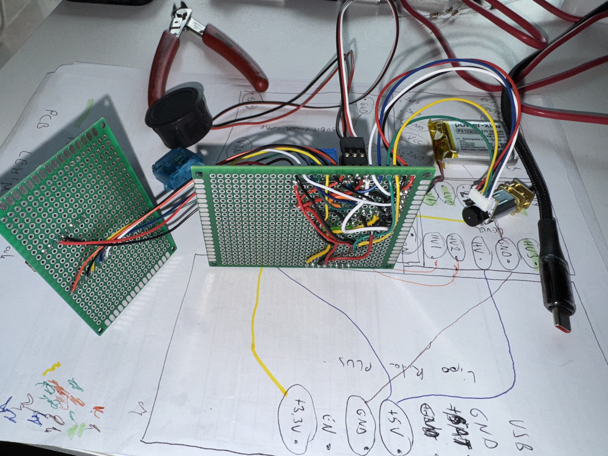

# Schemes Documentation

This folder contains the electrical schematics and wiring details for Team ANTi’s WRO 2025 Future Engineers robot. This documentation was last updated on **Tuesday, June 10, 2025, at 02:18 PM +03**.

## Overview
Our robot’s electronics are integrated on custom **pertinax boards** (perforated PCBs), meticulously cut to minimize size. All connections and soldering were performed by the team to ensure reliability and compactness. The system operates on three power lines:
- **+3V1**: Powers the STM32H747 microcontroller.
- **+2V8A**: Powers the GC2145 camera and VL53L1X ToF sensor.
- **+1V8**: Powers the microcontroller, camera, USB transceiver, and LSM6DSOX IMU.

## Schematics

### Bill of Materials (BOM) for Wiring Diagram
| Component           | Quantity | Type                      | Description                                   |
| ------------------- | -------- | ------------------------- | --------------------------------------------- |
| STM32H747           | 1        | Microcontroller           | Dual-core, high-performance microcontroller   |
| GC2145              | 1        | 2MP Camera                | 2MP CMOS camera, 2.2mm focal length, 80° view |
| VL53L1X             | 1        | ToF Sensor                | ToF sensor, 400cm range, full FoV             |
| LSM6DSOX            | 1        | 6-axis IMU                | 6-axis accelerometer and gyroscope IMU        |
| Feetech FS0307      | 1        | Servo Motor               | Submicro servo motor                          |
| DRV8833             | 1        | Motor Driver              | PWM motor driver                              |
| 1500 RPM N20        | 1        | DC Motor with Encoder     | Motor with quadrature encoder (2 Hall-effect) |
| Power-Xtra PX103035 | 1        | 3.7V 1000mAh LiPo Battery | 3.7V 1000mAh LiPo battery with PCM            |
| LiPo Rider Plus     | 1        | Charger/Booster           | USB-C charger/booster with power switch       |
| SX1308              | 1        | Voltage Booster           | 2A DC-DC Step-Up voltage booster              |
| BOB-12009           | 1        | Logic Level Converter     | 3.3V–5V logic level converter                 |
| KLS7-TS1204         | 1        | Tactile Switch            | Tactile switch (start action)                 |
| LEGO 87697          | 4        | Tire                      | Tire, 21mm diameter, 12mm width               |

### Power Distribution
- **Battery Management**: The LiPo Rider Plus manages charging (via USB-C) and provides a power switch. The SX1308 boosts voltage to stable levels for components.
- **Power Lines**:
  - +3V1: Microcontroller core and peripherals.
  - +2V8A: Camera and ToF sensor for consistent imaging and ranging.
  - +1V8: Low-power components like the IMU and USB transceiver.
- **Battery Performance**:
  - Capacity: 1000mAh.
  - Run Time: ~4–5 hours.
  - Charge Time: ~45 minutes (max 10W at 2A, 0.8W when fully charged).
  - Formula: Run time = Capacity (mAh) / Total Current (mA).
- **Power Consumption Breakdown**:
  - STM32H747: ~50mA at 3V1.
  - GC2145 Camera: ~80mA at 2V8A.
  - VL53L1X ToF: ~20mA at 2V8A.
  - LSM6DSOX IMU: ~5mA at 1V8.
  - Feetech FS0307 Servo: ~40mA at 3V1 (active).
  - 1500 RPM N20 Motor: ~60mA at 3V1.
  - Total Estimated Current: ~255mA (varies with activity).

### Wiring
- All connections are soldered on pertinax boards, cut to fit the 72mm x 57mm chassis.
- The tactile switch initiates robot operation, interfaced with the STM32H747.
- Micro USB is used for programming, separate from the USB-C charging port.

## Design Considerations
- **Compactness**: Pertinax boards were selected for their ease of manual production, avoiding external PCB fabrication time and cost.
- **Reliability**: Hand-soldered connections ensure robust electrical performance.
- **Power Efficiency**: The 1000mAh battery was selected for extended trial time, exceeding the 3-minute competition round.

## Datasheet List
- [BOB-12009.pdf](BOB-12009.pdf): Logic level converter specifications.
- [drv8833.pdf](drv8833.pdf): Motor driver specifications.
- [FS0307-specs.pdf](FS0307-specs.pdf): Servo motor specifications.
- [GC2145.pdf](GC2145.pdf): Camera sensor details.
- [kls7-ts1204.pdf](kls7-ts1204.pdf): Tactile switch specifications.
- [LiPoRiderPlus_ETA9740_V1.1.pdf](LiPoRiderPlus_ETA9740_V1.1.pdf): Charger/booster ETA specifications.
- [LiPoRiderPlus_SCH.pdf](LiPoRiderPlus_SCH.pdf): Charger/booster schematic.
- [lsm6dsox.pdf](lsm6dsox.pdf): IMU specifications.
- [N20_motors.pdf](N20_motors.pdf): N20 motor and encoder details.
- [stm32h747.pdf](stm32h747.pdf): Microcontroller specifications.
- [SX1308.pdf](SX1308.pdf): Voltage booster specifications.
- [vl53l1x.pdf](vl53l1x.pdf): ToF sensor specifications.
- [wiring_diagram.jpg](wiring_diagram.jpg): Wiring diagram image.

## Component Selection Details
- **STM32H747**: Chosen for its dual-core performance, enabling parallel processing of vision and control tasks.
- **GC2145**: Selected for its 80° view angle and low distortion, ideal for track detection.
- **VL53L1X**: Offers 400cm range for obstacle avoidance in dynamic environments.
- **LSM6DSOX**: Provides 6-axis stabilization for precise navigation.
- **Feetech FS0307**: Picked for its submicro size after testing larger servos (MG90S, SG90).
- **DRV8833**: Ensures efficient motor control with PWM support.
- **1500 RPM N20**: Chosen for small size and speed, validated by motor speed calculations.
- **Power-Xtra PX103035**: Selected for its compact 1000mAh capacity, supporting 4-5 hours of operation.
- **LiPo Rider Plus**: Provides reliable charging and power switching in a small form factor.
- **SX1308**: Boosts voltage efficiently for all components.
- **BOB-12009**: Ensures compatibility between 3.3V and 5V systems.
- **KLS7-TS1204**: Simple tactile switch for reliable start action.
- **LEGO 87697**: Opted for its 21mm diameter and 12mm width, offering good traction with a center ridge (see [comparison image](../other/lego87697_wheel_comparison.jpg) for selection comparison).
