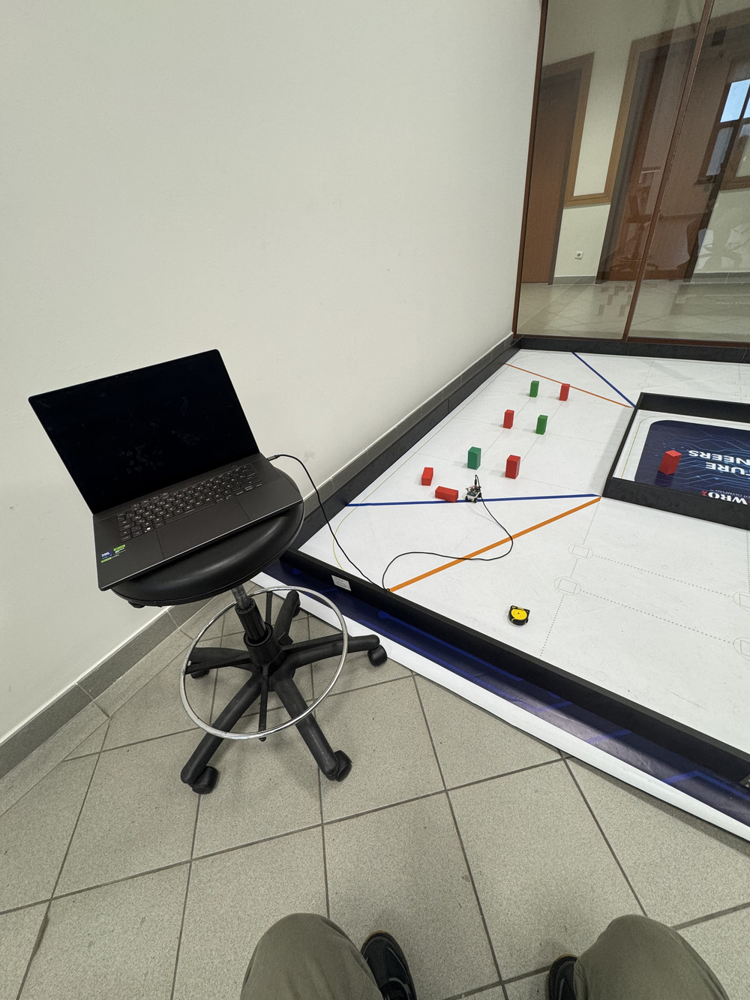
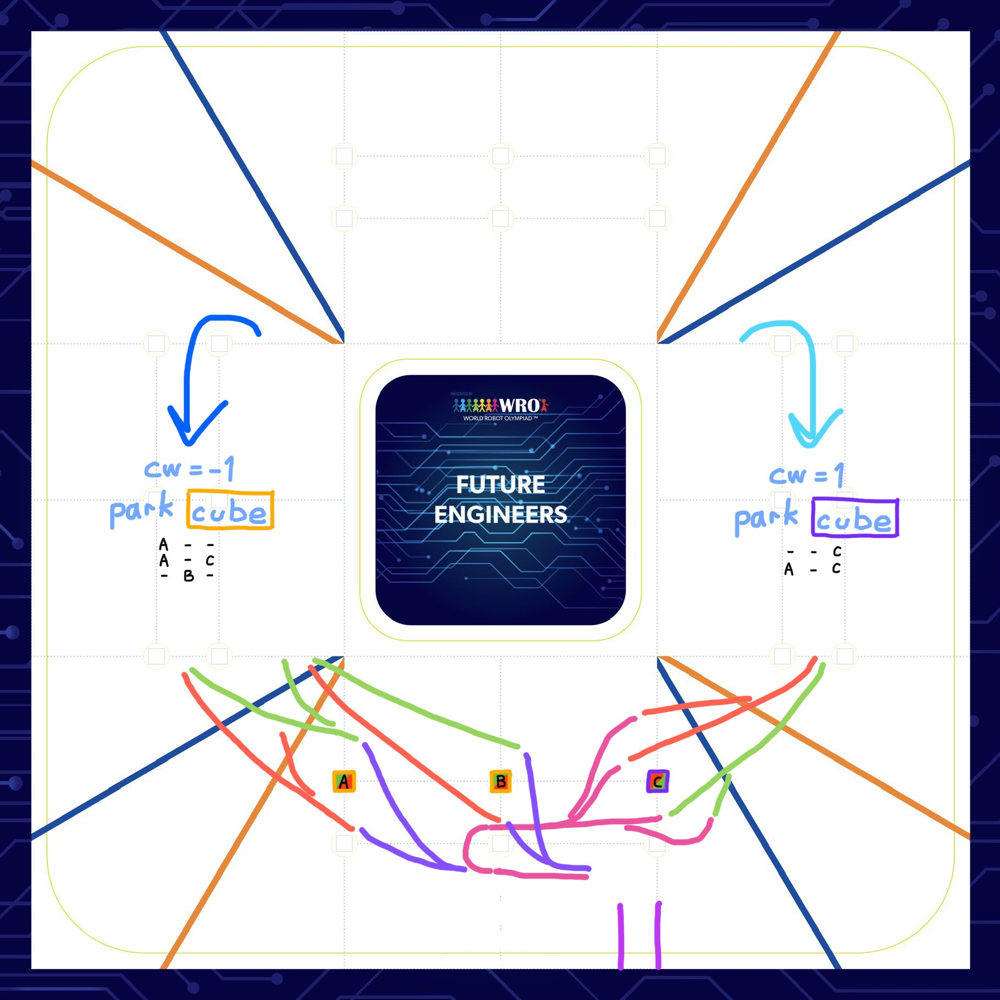
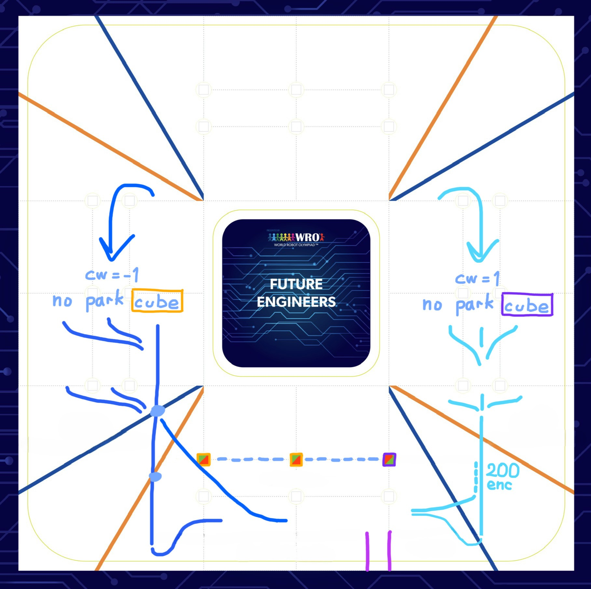
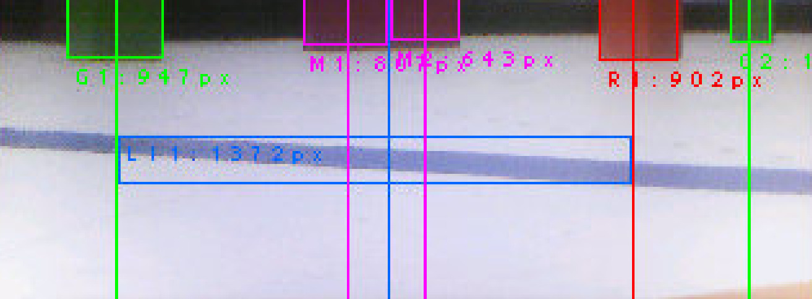
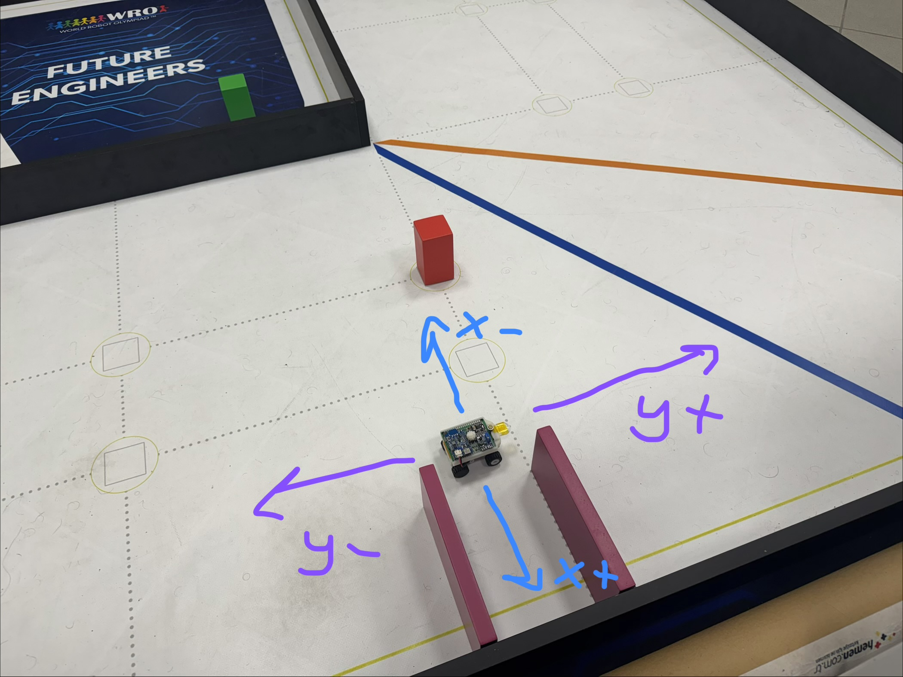
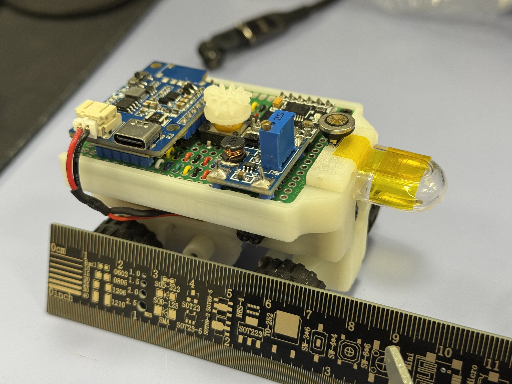
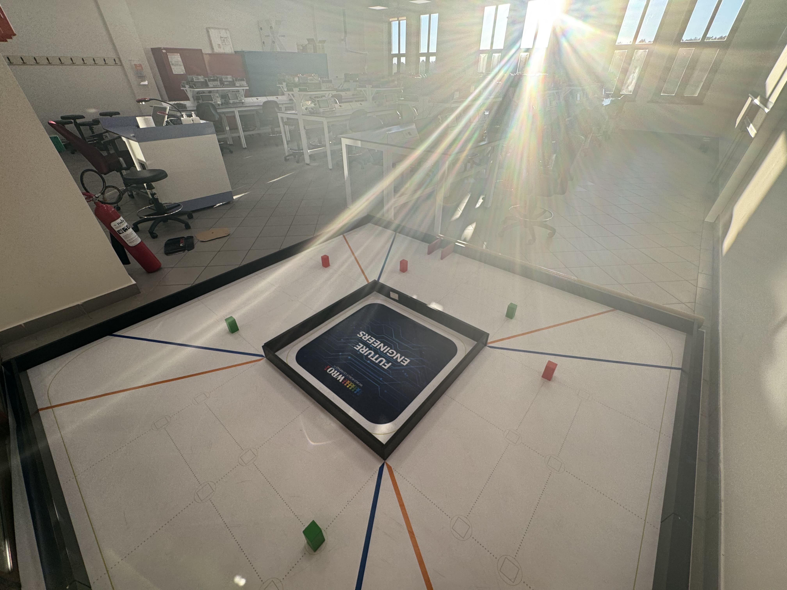

# Software Documentation

This folder contains the complete source code for Team ANTi's WRO 2025 Future Engineers robot, written in **MicroPython** for the STM32H747 camera microcontroller and **Arduino C++** for the nRF52832 sensor microcontroller. This documentation was last updated on **Saturday, November 09, 2025, at 04:48 AM +03**.

<table>
<tr>
<td width="60%">

## 🎯 Software Architecture Overview

Our software system implements a distributed architecture with two microcontrollers communicating via UART protocol:

- **STM32H747 (Camera MCU)**: Runs MicroPython for high-level navigation, computer vision, and main control logic
- **nRF52832 (Sensor MCU)**: Runs Arduino C++ for real-time sensor data acquisition and preprocessing
- **Bidirectional UART Communication**: 115200 baud rate for seamless data exchange between processors

</td>
<td width="40%">

<p align="center"><em>Software development and testing environment</em></p>
</td>
</tr>
</table>

## 💻 Programming Environment & Tools

### STM32H747 (Camera Microcontroller)
- **Language**: MicroPython
- **Programming**: Micro USB connection to evaluation board
- **Key Libraries**:
  - `machine` - Hardware control (PWM, GPIO, UART)
  - `pyb` - STM32-specific functions and timers
  - `sensor` - Camera interfacing and image processing

### nRF52832 (Sensor Microcontroller)
- **Language**: Arduino C++
- **Programming**: Micro USB connection to evaluation board
- **Key Libraries**:
  - `Wire.h` - I2C communication for sensors

### Ease of Use Features
We implemented a magnetic USB cable for the main camera microcontroller evaluation board, providing practical advantages for frequent programming and debugging sessions. The magnetic connection allows quick disconnects, prevents port damage from constant plugging, and simplifies the development workflow.

### Build & Deployment Process
1. **STM32H747 (MicroPython)**:
   - Copy `.py` files directly to microcontroller filesystem via the magnetic USB cable or micro USB
   - Automatic execution on startup from `main.py`
   - No compilation required - interpreted execution

2. **nRF52832 (Arduino C++)**:
   - Compile in Arduino IDE with nRF5 board support
   - Upload via micro USB to evaluation board
   - Precompiled binary deployment

## 🚀 Core Software Components

### Main Control Files

| File | Microcontroller | Language | Purpose |
|------|----------------|----------|---------|
| [`open.py`](open.py) | STM32H747 | MicroPython | Open Challenge navigation with inner wall following |
| [`obstacle.py`](obstacle.py) | STM32H747 | MicroPython | Obstacle Challenge with color detection and parking |
| [`uart_slave.ino`](uart_slave.ino) | nRF52832 | Arduino C++ | Sensor data acquisition and UART communication |

### Sensor Fusion Architecture

**Data Flow Pipeline**:
```
nRF52832 Sensors ←→  UART  ←→ STM32H747 → Sensor Fusion → Control Decisions
     ↑                            ↑             ↑               ↓
  ToF Left                      Camera     PID Controller   Motor/Servo
  ToF Right                     Vision     State Machine     Actuators
 Encoder Data                  IMU Data
                               ToF Front
```

## 🎯 Navigation Strategies & Algorithms

### Open Challenge Strategy
The Open Challenge requires completing laps by following the inner wall while detecting corners using orange/blue markers.

**Key Algorithm Features**:
- **Initial Direction Detection**: Uses front ToF sensor (<800mm) and camera-based orange/blue detection to determine clockwise/counterclockwise direction
- **Wall Following**: Camera-based black wall detection with PID control
- **Corner Detection**: Orange/blue marker recognition for lap counting
- **IMU Integration**: Gyroscope-based heading maintenance
- **Encoder Odometry**: Precise distance tracking for segment navigation

**State Machine Flow**:
```
Initial Forward → Follow Wall → Turn Corner → Follow Wall (repeat)
      ↑               ↑             ↑             ↑
  ToF + Color     Camera PID    IMU 90° Turn  Continue
  Detection      Wall Tracking                Navigation
```

**Open Challenge Pseudocode**:
```
INITIALIZE sensors, set direction = unknown
WHILE direction == unknown:
    DRIVE forward using IMU guidance
    DETECT orange/blue colors
    IF orange detected first: SET direction = clockwise
    IF blue detected first: SET direction = counterclockwise
    IF front ToF < 800mm: TRANSITION to wall following

WHILE corner_count < 12:
    FOLLOW inner wall using camera PID
    DETECT orange/blue corners
    IF corner detected: INCREMENT corner_count
    IF wall lost and min_distance traveled: EXECUTE 90° turn
    UPDATE odometry and heading

EXECUTE final forward movement
STOP
```

### Obstacle Challenge Strategy  
The Obstacle Challenge involves navigating while respecting traffic signs (red: right avoid, green: left avoid) and performing parallel parking.

**Color-Based Navigation**:
- **Red Detection**: Steer right with optimal offset positioning
- **Green Detection**: Steer left with precise camera alignment  
- **Magenta Detection**: Trigger parking maneuver sequence
- **Obstacle Avoidance**: Shortest-path planning around obstacles

**Advanced Features**:
- **Smooth Following**: Maintains obstacles at consistent pixel positions
- **Memory System**: Remembers last detected color during brief losses
- **Search Patterns**: Progressive search algorithms for lost objects

**State Machine Flow**:
```
Determine Direction → Follow Color → Lost Color → Pass Color → U-Turn → Parking
        ↑                 ↑             ↑            ↑           ↑         ↑
   ToF + Color        Camera PID      Search      Avoidance   180° Turn  Magenta
   Detection          Color Track     Pattern     Maneuver    Maneuver   Detection
```

**Obstacle Challenge Pseudocode**:
```
INITIALIZE sensors
DETERMINE direction using side ToF sensors
EXECUTE initial alignment maneuver

WHILE corner_count < 13:
    NAVIGATE using camera color detection
    IF red detected: FOLLOW with right offset
    IF green detected: FOLLOW with left offset  
    IF color lost: SEARCH pattern
    IF color not found: PASS obstacle maneuver
    DETECT orange/blue corners for lap counting

EXECUTE 180° U-turn maneuver
APPROACH parking zone
DETECT magenta parking marker
EXECUTE parallel parking sequence
STOP
```

### Parking Strategy Analysis
We analyzed all possible parking scenarios after completing 3 laps:

<p align="center">
  
  
</p>
<p align="center">
  <em>1) Parking paths including correct final cube avoidance • 2) Direct parking entry without checking final cube</em>
</p>

### Obstacle Combination Strategies
Our algorithm handles all possible obstacle configurations for both directions:

<p align="center">
  
  
</p>
<p align="center">
  <em>1) Clockwise navigation with A,B,C,D obstacle combinations 1-6 • 2) Counter-clockwise navigation with A,B,C,D obstacle combinations 1-6</em>
</p>

## 🎨 Computer Vision System

### CIELAB Color Space Selection
We chose the **CIELAB color space** for superior color differentiation under varying lighting conditions compared to traditional RGB or HSV spaces. Our custom `ANTi_threshold_finder.m` MATLAB code helped us determine optimal thresholds for reliable detection through systematic analysis of color distributions under various lighting conditions.

**Color Thresholds (L_min, L_max, A_min, A_max, B_min, B_max)**:
```python
th = {
    "R": [(25, 65, 35, 75, -10, 20)],    # Red obstacle
    "G": [(30, 70, -40, -10, 10, 50)],   # Green obstacle  
    "M": [(40, 80, 60, 90, -20, 30)],    # Magenta parking
    "BK": [(0, 25, -10, 20, -15, 10)],   # Black wall
    "O": [(5, 60, 5, 20, 0, 25)],        # Orange corner
    "B": [(5, 60, 5, 80, -80, -25)]      # Blue corner
}
```

### Vision Processing Pipeline
1. **Image Acquisition**: 320x240 QVGA resolution at 26 FPS
2. **Color Conversion**: RGB565 to CIELAB color space
3. **Blob Detection**: `find_blobs()` with area and pixel thresholds
4. **Target Selection**: Largest blob for reliability
5. **Error Calculation**: Centroid deviation from camera center

<p align="center">
  
  
</p>

## ⚙️ Control Systems & Sensor Fusion

### PID Control Implementation
**Steering Control**:
```python
# PID gains tuned for smooth navigation
kp, ki, kd = 2.0, 0.001, 1.0
error = cam_error * 0.3 + heading_diff * 0.7
pid_integral = max(-100, min(100, pid_integral + error * ki))
steer = error * kp + pid_integral + (error - last_error) * kd
```

**Code Example from open.py**:
```python
# PID control execution in main loop
pid_integral = max(-100, min(100, pid_integral + error * ki))
steer = error * kp + pid_integral + (error - last_error) * kd
last_error = error
current_speed += min(2, max(-2, target_speed - current_speed))
set_speed(current_speed)
set_steering(240 + steer)
```

**Encoder-Based Positioning Odometry System**:
```python
delta_enc = encoder - last_enc  # Calculate encoder change since last reading
odometry_x += delta_enc * math.cos(math.radians(angle))  # Update X position (left/right)
odometry_y += delta_enc * math.sin(math.radians(angle))  # Update Y position (forward/backward)
```

<p align="center">
  
</p>
<p align="center"><em>Coordinate system for encoder-based position tracking (Y+ forward, Y- backward, X- left, X+ right)</em></p>

**Sensor Fusion Strategy**:
- **Primary**: Camera vision for precise positioning
- **Secondary**: IMU gyroscope for heading maintenance  
- **Tertiary**: ToF sensors for parking detection
- **Extra fallback**: Encoder odometry solution tested and ready to implement as backup for distance tracking

### UART Communication Protocol
**Bidirectional Communication Architecture**:

The UART communication between STM32H747 (master) and nRF52832 (slave) implements a robust bidirectional protocol at 115200 baud rate:

**Master (STM32H747) → Slave (nRF52832) Commands**:
- `'r'` - Request all sensor data (left_tof, right_tof, encoder)
- `'t'` - Request left ToF sensor only
- `'u'` - Request right ToF sensor only  
- `'e'` - Request encoder travel distance only
- `'z'` - Reset encoder counter to zero

**Slave Response Formats**:
- **All sensors**: `left_distance,right_distance,encoder_distance\n`
- **Left ToF only**: `left_distance\n`
- **Right ToF only**: `right_distance\n`
- **Encoder only**: `encoder_distance\n`

**Communication Initialization**:
1. **Slave Ready Signal**: nRF52832 sends `0x01` byte when initialized
2. **Master Detection**: STM32H747 waits for ready signal with timeout
3. **Command Cycle**: Continuous request-response pattern during operation

**Data Packet Structure**:
- **Command Byte**: Single character sent from master
- **Response Data**: Comma-separated values or single value from slave
- **Termination**: Newline character (`\n`) marks end of transmission
- **Timeout Handling**: 50ms timeout prevents communication deadlocks

**Multi-Sensor Data Transmission**:
The slave efficiently packages sensor readings into optimized responses:
- **ToF Sensors**: Left and right distance values (0-4000mm range) with bounds checking
- **Encoder Data**: Travel distance in millimeters with float precision (2 decimal places)
- **Data Integrity**: Validation and error handling on both ends

**Hardware Configuration**:
```python
# STM32H747 UART setup
uart = UART(9, baudrate=115200, bits=8, parity=None, stop=1)
```

**Code Example from obstacle.py**:
```python
def fetch_data(command, timeout=50):
    # Send command to slave and parse response
    global tof_left, tof_right, encoder, uart_buffer
    uart.write(command)
    if command in (b'z', b'p'): return True  # No response needed
    start_time = pyb.millis()
    while pyb.elapsed_millis(start_time) < timeout:
        if uart.any():
            uart_buffer += uart.read(uart.any())
            if b'\n' in uart_buffer:
                line, uart_buffer = uart_buffer.split(b'\n', 1)
                if command == b'r' and line.count(b',') == 2:
                    parts = line.split(b',')
                    tof_left = int(parts[0])
                    tof_right = int(parts[1])
                    encoder = float(parts[2])
                    return True
    return False  # Timeout
```

**Code Example from uart_slave.ino**:
```cpp
void processUARTCommand(char command) {
  // Process commands from main vehicle controller
  int left_dist = readDistanceSensor(LEFT_DISTANCE_SENSOR_ADDR);
  int right_dist = readDistanceSensor(RIGHT_DISTANCE_SENSOR_ADDR);
  float travel_distance = encoder_count / PULSES_PER_MILLIMETER;
  
  switch (command) {
    case 'r':  // Return all sensor readings: left_tof,right_tof,encoder
      SERIAL_PORT.print(left_dist); SERIAL_PORT.print(',');
      SERIAL_PORT.print(right_dist); SERIAL_PORT.print(',');
      SERIAL_PORT.println(travel_distance, 2);
      break;
      
    case 't':  // Left sensor only
      SERIAL_PORT.println(left_dist);
      break;
      
    case 'u':  // Right sensor only  
      SERIAL_PORT.println(right_dist);
      break;
      
    case 'e':  // Encoder travel distance
      SERIAL_PORT.println(travel_distance, 2);
      break;
      
    case 'z':  // Reset encoder counter
      encoder_count = 0;
      break;
      
    default:   // Unknown command - ignore
      break;
  }
}
```

**Communication Flow**:
1. **Master Request**: STM32H747 sends single character command
2. **Slave Processing**: nRF52832 reads sensors and formats response
3. **Data Transmission**: Slave sends formatted data with newline termination
4. **Master Parsing**: STM32H747 receives and parses data into global variables
5. **Buffer Management**: Circular buffer handles partial messages and timeouts

This protocol provides flexible sensor data access while maintaining efficient communication bandwidth usage.

## 🛠️ Engineering Challenges & Solutions

### Real-Time Performance Optimization
**Challenge**: MicroPython interpretation overhead affecting control loop frequency

**Solution**:
- Optimized blob detection with restricted ROIs
- Pre-computed color thresholds
- Efficient UART data parsing
- Balanced control loop timing (15-30ms cycles)

### IMU Integration Strategy
**Challenge**: Hardware interrupt-based IMU reading caused significant runtime performance decrease, affecting camera operation and framerate

**Solution**: We implemented a basic IMU calculation approach executed each control loop cycle rather than using interrupts. Despite theoretical advantages of interrupt-based IMU, our solution proved sufficient because:

- **Control Loop Speed**: Each cycle executes rapidly enough for accurate angle integration
- **Camera Priority**: Maintaining high camera framerate was critical for reliable color detection
- **Sufficient Accuracy**: Even with basic integration, our IMU provided perfect angle values for vehicle navigation
- **Performance Validation**: Achieved competition-best times (16s Open, 35s Obstacle) confirming IMU reliability

**10-Second IMU Calibration Routine:**:
```python
# Collect 1000 samples to determine zero offset
calibration_samples = 1000
calibration_sum = 0.0
while calibration_count < calibration_samples:
    gyro_sample = read_gyro()
    calibration_sum += gyro_sample
    calibration_count += 1
gyro_zero_offset = calibration_sum / calibration_count
```

**Implementation**:
```python
# Basic gyro integration each control cycle
gyro = read_gyro() - gyro_zero_offset
angle += gyro * dt
```

This approach allowed us to maintain both high-performance camera operation and accurate IMU readings, demonstrating that sometimes simpler solutions can be more effective in integrated systems.

### 🅿️ Parallel Parking Strategy Optimization
**🚧 Challenge**: Our compact vehicle design (69mm length) required extremely precise parallel parking maneuvers within the tight 1.5× vehicle length parking space (103.5mm)

**💡 Solution**: We designed and implemented a strategic front extension piece that provided crucial benefits:

- **📏 Length Extension**: Added 21mm front piece increased total vehicle length to 90mm
- **Parking Space Optimization**: Parking lot requirement became 90mm × 1.5 = 135mm (13.5cm)
- **Critical Width Design**: The narrow width of the extension piece allowed clearance from parking walls during turning maneuvers
- **🔄 Improved Maneuverability**: Additional space enabled more reliable parking execution

**Multi-Stage Parking Maneuver**:
1. **Approach**: Follow magenta wall with camera guidance
2. **Turn-in**: 80-degree turn outside parking spot
3. **Alignment**: Odometry-based reverse positioning
4. **Reverse**: Controlled backing for final alignment
5. **Straighten**: Final orientation adjustment

> 💡🐜 ***Fun Discovery***: The distinctive front extension piece gave our vehicle a unique appearance that reminded us of an **ANT**'s mandible, perfectly matching our team name and creating a memorable visual identity!

<p align="center">
  
  
</p>
<p align="center">
  <em>1) Original 69mm vehicle in tight parking space • 2) Extended 90mm vehicle with strategic front piece</em>
</p>

### Lighting Condition Adaptation

**🌅 Challenge**: Varying competition lighting conditions affecting color detection accuracy

**💡 Solution**:
- 🎨 **CIELAB Color Space** for superior lighting invariance compared to traditional RGB or HSV spaces
- 📊 **MATLAB Analysis** using our custom `ANTi_threshold_finder.m` code for systematic color distribution analysis
- **Extensive Calibration** under multiple lighting conditions including direct sunlight
- ⚙️ **Dynamic Threshold Adjustment** based on ambient light levels
- **Robust Blob Detection Parameters** with optimized area and pixel thresholds

<p align="center">
  
</p>
<p align="center"><em>Comprehensive testing under challenging lighting conditions including direct sunlight</em></p>

## 📊 Navigation Flow & State Machines

### ⚡ Open Challenge Detailed Strategy
**Initial Phase - Direction Determination**:
1. **Unknown Start**: Begin with direction = 0 (unknown)
2. **Forward Approach**: Drive straight using IMU guidance only
3. **Color Detection**: Simultaneously detect orange or blue markers
4. **Direction Assignment**: First detected color sets direction (orange: CW=1, blue: CCW=-1)
5. **ToF Transition**: Switch to camera guidance when front ToF detects <800mm

**Main Navigation Phase**:
- **Wall Following**: Camera-based black wall tracking with PID control
- **Corner Detection**: Orange/blue markers increment corner count
- **Precise Turns**: 90-degree turns using IMU gyro integration
- **Segment Management**: Encoder-based distance tracking between corners

### 🚦Obstacle Following Approach
Our obstacle navigation implements an advanced following strategy that maintains optimal positioning:

**Core Following Logic**:
- **Consistent Positioning**: Maintain obstacles at specific X pixel positions in camera frame
- **Offset Calculation**: Different offsets for inner (30px) and outer (30px) obstacles based on direction
- **Smooth Tracking**: PID control combines camera error with heading error for smooth combined sensor fusion and vehicle motion
- **Shortest Path**: Algorithm always forms the most direct path around obstacles

**Color-Specific Behavior**:
- **Red Obstacles**: Keep at *CAM_CENTER - offset* (left offset positioning for proper right avoidance)
- **Green Obstacles**: Keep at *CAM_CENTER + offset* (right offset positioning for proper left avoidance)  
- **Adaptive Offsets**: Direction and color dependent offset calculation for universal strategy
- **Sensor Fusion**: Heading IMU sensor combined with camera vision for smooth, stable control approach

**Performance Advantage**: This approach enables both high speed (1.4 m/s operational) and minimal oscillation, creating the smoothest target-driven algorithm in the competition through precise sensor fusion of vision and angle guidance.

## 🧪 Testing & Validation

### Test Suite (`/tests` Directory)
- [`blink.py`](tests/blink.py) - LED and basic I/O verification
- [`camera_test.py`](tests/camera_test.py) - Camera functionality and color detection
- [`imu_test.py`](tests/imu_test.py) - Gyroscope calibration and reading
- [`tof_test.py`](tests/tof_test.py) - Distance sensor validation
- [`button_photo.py`](tests/button_photo.py) - Input device testing

### Simulation Concept
We initially developed a Webots simulation (`ANTi_wro_sim.wbt`) as a universal testing platform. However, due to timeline constraints and the complexity of accurately modeling our custom mechanical systems and sensor behaviors, we converted our development focus directly to physical implementation. The simulation served as a valuable conceptual framework before transitioning to real-world testing.

<p align="center">
  
</p>
<p align="center"><em>Initial Webots simulation environment used for conceptual development and algorithm testing</em></p>

### 🏆 Performance Validation
- **Open Challenge**: 16 seconds full score - [Watch Performance Video](../video/README.md#competition-performance-videos)
- **Obstacle Challenge**: 35 seconds full score - [Watch Performance Video](../video/README.md#competition-performance-videos)
- **Color Detection**: >95% accuracy under competition lighting
- **Control Response**: <50ms latency from detection to actuation

**Video Documentation**: Full performance demonstrations showcasing our robot's capabilities in both challenges are available in our [Video Documentation](../video/README.md), including:
- 🎯 Autonomous navigation and speed control on dynamic tracks
- 🚦 Traffic sign detection and obstacle avoidance
- 🅿️ Optimal path planning and parallel parking maneuvers
- ⚡ Smooth obstacle following at consistent distances

## 📁 File Structure & Dependencies

### Complete File List
| File | Description |
|------|-------------|
| [`open.py`](open.py) | Open Challenge main control logic |
| [`obstacle.py`](obstacle.py) | Obstacle Challenge with parking |
| [`uart_slave.ino`](uart_slave.ino) | nRF52832 sensor firmware |
| [`ANTi_wro_sim.wbt`](ANTi_wro_sim.wbt) | Webots simulation file (conceptual reference) |
| [`/tests/`](tests/) | Development and validation test scripts |

### External Dependencies
- **MicroPython Firmware** - STM32H747 compatible version
- **Arduino nRF5 Board Support** - nRF52832 compilation

## 🚀 Deployment Instructions

### STM32H747 Setup (Camera MCU)
1. Connect via magnetic micro USB cable to computer
2. Copy MicroPython files to microcontroller filesystem:
   ```bash
   cp open.py /path/to/stm32/
   cp obstacle.py /path/to/stm32/ 
   ```
3. Files execute automatically on startup from `main.py`

### nRF52832 Setup (Sensor MCU)  
1. Open `uart_slave.ino` in Arduino IDE
2. Select nRF52832 board and proper port
3. Compile and upload via micro USB
4. Verify sensor data over Serial monitor

### System Startup
1. Power on LiPo Rider Plus switch
2. Wait for slave microcontroller ready signal
3. Press tactile start button to begin navigation
4. RGB LED indicates operational status

## ✅ Code Quality & Best Practices

### Software Engineering Principles
- **Modular Design**: Separated vision, control, and sensor modules
- **Comprehensive Documentation**: Inline comments and function descriptions
- **Error Handling**: Robust exception handling with LED status indicators
- **Resource Management**: Efficient memory usage and power management

### Performance Optimizations
- **Minimal Memory Allocation**: Pre-allocated buffers and fixed-size arrays
- **Efficient Algorithms**: Optimized blob detection and PID computations
- **Timing Control**: Balanced control loop frequencies for stability
- **Sensor Fusion**: Intelligent data weighting and validation

## 🔮 Future Improvements

### Planned Enhancements
- **Machine Learning Integration**: Lightweight neural network for improved color classification if traditional thresholding proves insufficient
- **Dynamic Path Planning**: A* algorithm implementation for optimal obstacle avoidance
- **Adaptive Control**: Self-tuning PID parameters based on performance metrics
- **Extended Simulation**: Enhanced Webots model for algorithm validation

### Research Directions
- **Wireless Communication**: Real-time performance monitoring only for debugging process
- **Advanced Sensor Fusion**: Kalman filtering for improved position estimation
- **Energy Optimization**: Dynamic power management based on task requirements
- **Custom Modular Sensor System**: Easy reconfiguration with existing sockets

We challenged ourselves beyond the traditional competition rules to further develop our engineering knowledge across all aspects of the project, and we encourage future teams to continue this philosophy of pushing boundaries while maintaining comprehensive documentation.

---

This comprehensive software documentation provides complete transparency into our algorithm design, implementation details, and engineering decision-making process. All code is structured for easy understanding and replication, meeting WRO Future Engineers competition requirements for detailed technical documentation.

For hardware implementation: [Schemes Documentation](../schemes/README.md)  
For mechanical design: [Models Documentation](../models/README.md)  
For performance videos: [Video Documentation](../video/README.md)  
For additional resources: [Other Documentation](../other/README.md)