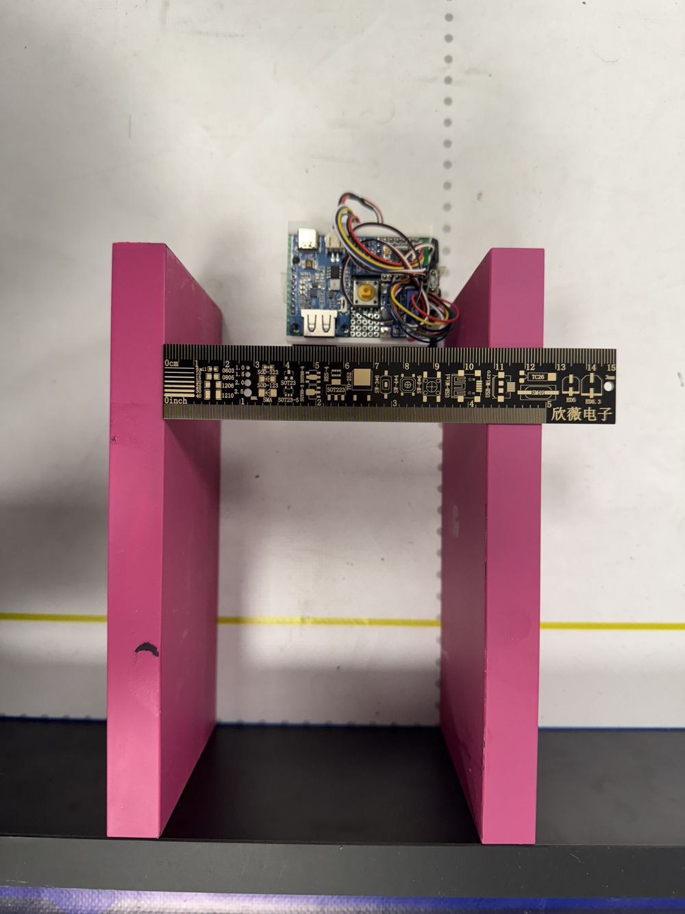
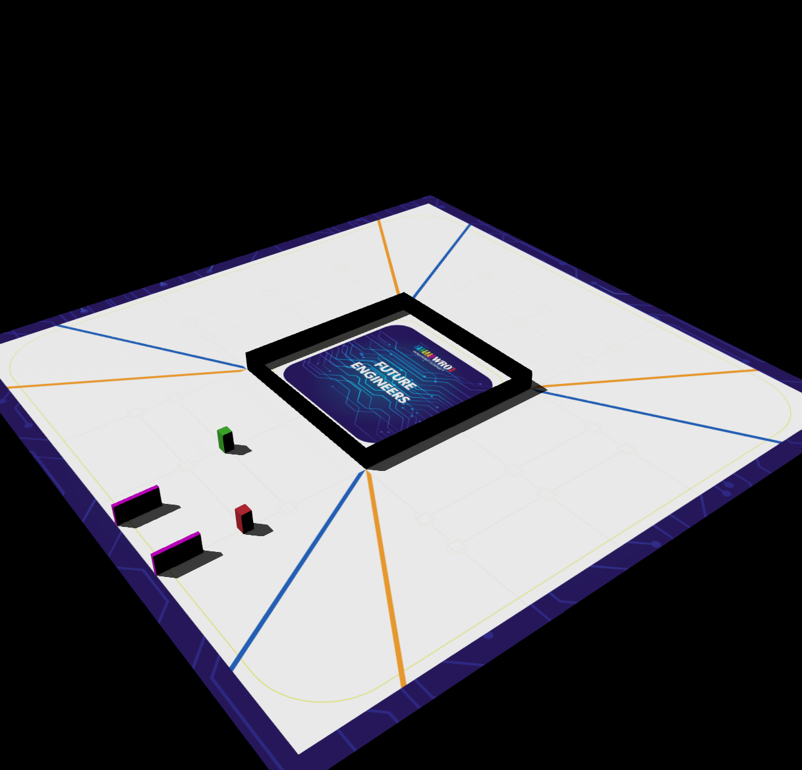

# Software Documentation

This folder contains the source code for Team ANTi’s WRO 2025 Future Engineers robot, written in **MicroPython** and running on the **STM32H747 dual-core microcontroller**. This documentation was last updated on **Friday, May 30, 2025, at 05:30 AM +03**.

## Software Overview
Our software handles the WRO 2025 challenges: navigating dynamic racetracks, respecting traffic signs, avoiding obstacles, and performing parallel parking. Key features include:
- **Computer Vision**: Uses the **GC2145 2MP camera** with **CIELAB color space** for detecting track elements, traffic signs (red, green), and parking zones (magenta).
- **Sensor Fusion**: Integrates data from the **VL53L1X ToF sensor**, **LSM6DSOX IMU**, and camera for precise navigation, using hardware interrupts for smooth data combination.
- **Control System**: Manages the **Feetech FS0307 servo** for steering and **1500 RPM N20 motor** for movement via PWM control.

## Programming Environment
- **Language**: MicroPython (chosen for rapid development and compatibility with STM32H747).
- **Interface**: Programming via micro USB cable.
- **Libraries**:
  - `machine`: For hardware control (PWM, GPIO).
  - `pyb`: For STM32-specific functions.
  - `sensor`: For camera interfacing.
- **Development Tools**: VS Code.

## Navigation Strategy
Our robot addresses both the Open and Obstacle Challenges with tailored strategies:

### Open Challenge Strategy
The Open Challenge requires completing three laps on a dynamic track by detecting orange and blue markers to determine direction (clockwise or counterclockwise).
- **Marker Detection**: The camera scans for orange (clockwise) or blue (counterclockwise) markers to set the turn direction.
- **Movement Pattern**: Moves in segments, checking for markers after each move, then follows a 12-corner pattern with 90° turns.
- **Distance Tracking**: Uses the encoder, camera and ToF to measure distance traveled and adjust movements.

### Obstacle Challenge Strategy
The Obstacle Challenge involves navigating three laps, respecting traffic signs (red: steer right, green: steer left), avoiding obstacles, and parallel parking at a magenta marker.
- **Traffic Sign Detection**: Detects red and green signs to adjust steering direction.
- **Obstacle Avoidance**: Uses ToF sensor to detect obstacles (<100cm) and performs avoidance maneuvers (e.g., turn-move-turn sequences).
- **Parallel Parking**: Identifies a magenta marker and moves into the parking spot.

#### Navigation Flow Diagram
1. **Initialize**: Start on button press, initialize sensors (camera, ToF, IMU, encoder).
2. **Open Challenge Loop**:
   - Move forward in segments → Detect orange/blue markers.
   - Set direction (clockwise if orange, counterclockwise if blue).
   - Complete remaining distance → Execute 12-corner pattern with 90° turns.
3. **Obstacle Challenge Loop**:
   - Move forward → Detect red/green signs → Adjust steering (right for red, left for green).
   - Turn accordingly to the future detected signs.
   - If obstacle <100cm → Perform extra avoidance maneuver.
   - If magenta detected → Move into parking spot → Stop.
4. **End**: Enter low-power mode (standby).

#### Pseudocode for Open Challenge (Marker Detection and Movement)
```
INITIALIZE sensors (camera, tof, imu, encoder)
SET direction = 0, remaining_distance = 150cm

WHILE remaining_distance > 0:
    MOVE segment_distance
    DETECT orange, blue markers
    IF orange: SET direction = clockwise
    ELSE IF blue: SET direction = counterclockwise
    REDUCE remaining_distance

IF direction = 0: SET direction = clockwise
MOVE remaining_distance

FOR 12 corners:
    TURN 90° in direction
    MOVE 290cm (or 130cm for last corner)
STOP
```

#### Pseudocode for Obstacle Challenge (Sign Detection and Parking)
```
INITIALIZE sensors (camera, tof, imu, encoder)
FOR 4 laps:
    MOVE 50cm
    DETECT red, green, magenta, distance
    IF magenta: MOVE 10cm → STOP
    IF distance < 100cm:
        IF red: AVOID right
        IF green: AVOID left
        ELSE: AVOID right
    ELSE IF lap < 3: TURN 90°
STOP
```

## Vision Processing
The vision system uses the GC2145 camera with CIELAB color space for robust detection under varying lighting:
- **Track Detection**: Identifies dark lines (R,G,B < 50) to adjust steering.
- **Marker Detection (Open Challenge)**: Detects orange (R>60, G<40) and blue (B>60, R<40) markers to determine turn direction.
- **Sign Detection (Obstacle Challenge)**: Detects red (R>60, G,B<40), green (G>60, R,B<40), and magenta (R,B>50, G<30) for navigation and parking.


## Algorithms
- **Track Navigation**:
  - Uses camera to detect dark lines and adjust steering.
  - Encoder tracks distance for precise movements.
- **Traffic Sign Detection**:
  - Red signs: Steer right.
  - Green signs: Steer left.
  - Magenta: Triggers parking maneuver.
- **Obstacle Avoidance**:
  - ToF sensor detects obstacles <100cm.
  - Executes a turn-move-turn sequence to navigate around obstacles.
- **Parallel Parking**:
  - Combines camera (magenta detection) and ToF (distance) to locate parking zone.
  - Executes a precomputed trajectory using Ackermann steering.
- **Sensor Fusion**:
  - Adaptive low-pass filter, Adaptive Moving Average (AMA) filter, and PID control integrate IMU and ToF data for stability.
  - Camera data prioritizes visual feedback, with ToF as a fallback for distance validation.

<table>
  <tr>
    <td></td>
    <td></td>
    <td></td>
  </tr>
</table>

## File List
- `open.py`: Main control loop for the Open Challenge, handling marker detection and 12-corner navigation.
- `obstacle.py`: Control logic for the Obstacle Challenge, managing sign detection, obstacle avoidance, and parking.
- `/tests`: Contains several basic tests that were done while learning.
- `ANTi_wro_sim.wbt`: The Webots simulation (referenced as `other/ANTi_wro_sim.png`) was initially developed as a universal simulation but was converted directly into physical work due to timeline constraints.  
  

## Coding Practices
- **Modularity**: Code is organized into functions (vision, control, sensor handling) for independent testing.
- **Documentation**: Inline comments and function explanations ensure clarity.
- **Testing**: Iterative testing on a test WRO track to validate algorithms.

## Setup Instructions
1. Connect the robot to a computer via micro USB.
2. Copy the contents of the `src` folder to the microcontroller.
3. Switch on the LiPo Rider Plus to power the robot.
4. Press the KLS7-TS1204 tactile switch to start the robot.

For hardware details, see [Schemes Documentation](../schemes/README.md).

## Future Improvements
- **Machine Learning Integration**: Train a lightweight neural network on the STM32H747 to improve sign detection accuracy under diverse lighting conditions.
- **Dynamic Path Planning**: Implement A* algorithm for more efficient obstacle avoidance, reducing lap times.