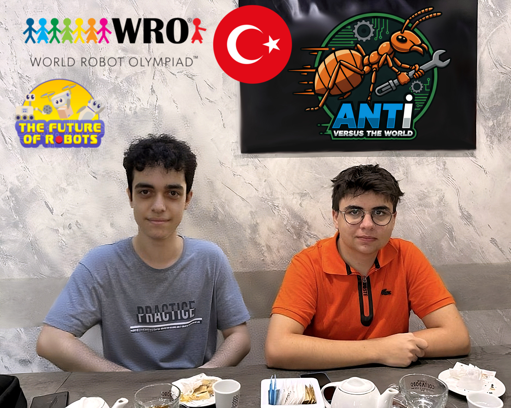
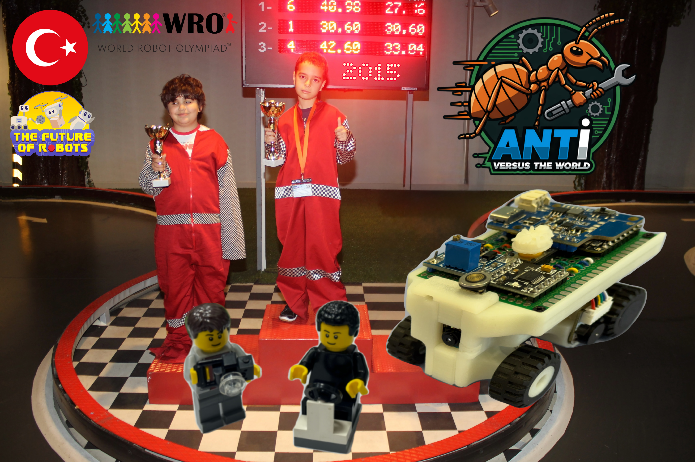
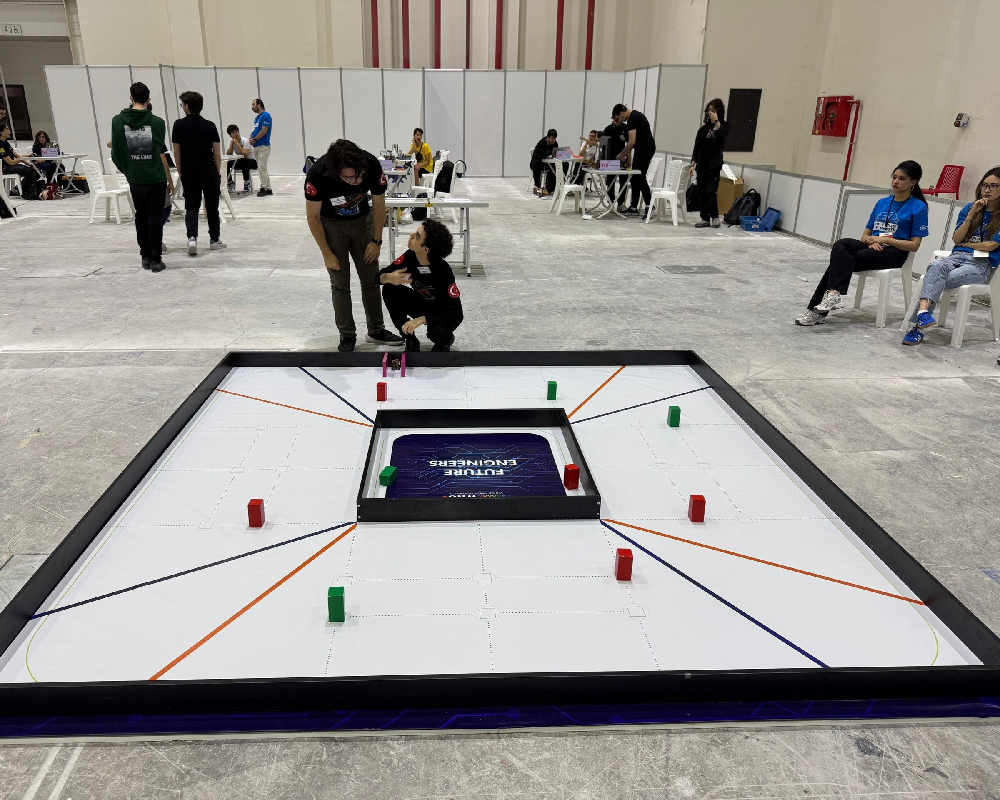
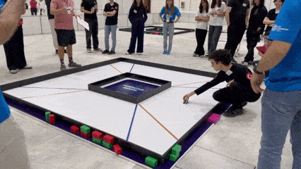

# Team Photos

This folder contains official and informal photos of Team ANTi, showcasing our team spirit and collaboration during the WRO 2025 Future Engineers project. This documentation was last updated on **Tuesday, November 04, 2025, at 05:12 PM +03**.

## Photo List
- `team_official.jpg`: Official team photo with all members.
- `team_fun.jpg`: Informal team moment.
> 💡 *Fun Fact*: The fun team photo (`team_fun.jpg`) is our childhood photo from 2015, when we were 9 years old, standing on a go-kart race podium!
- `workplace.jpg`: Team working on the robot in the lab.
- `team_moment.jpg`: Team collaboration during national final competition - discussing strategy while testing the vehicle on the field and preparing to activate it.
- `team_moment.gif`: Dynamic sequence of official competition start during national final - team member pressing start button with excitement as vehicle begins its run

## Notes
- All photos are high-resolution and suitable for WRO documentation.
- Additional photos may be added as the competition progresses.
- Follow us on 📸 [Instagram](https://www.instagram.com/anti.wro) for more team updates.

For more about our team, see [The Team](../README.md#the-team).