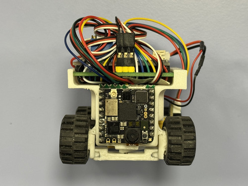
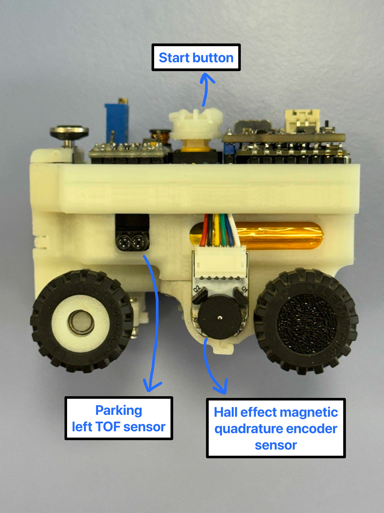
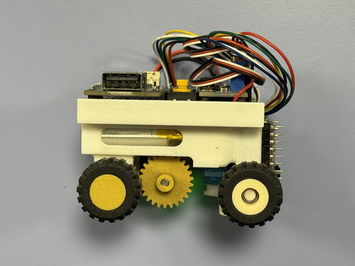
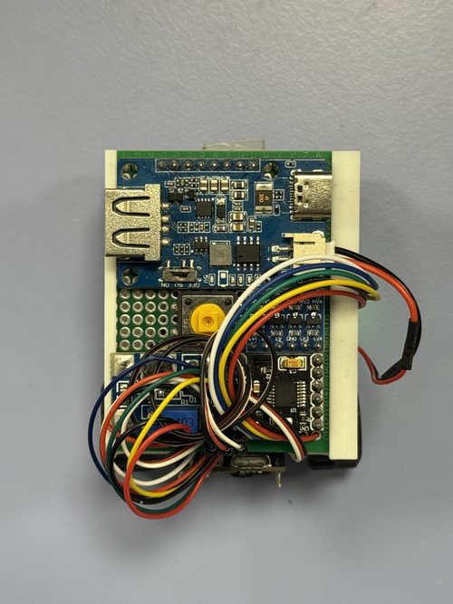
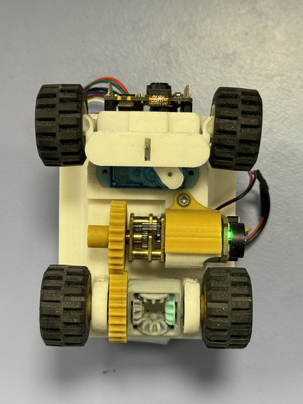

# Vehicle Photos

This folder contains high-quality photos of Team ANTi’s WRO 2025 Future Engineers robot, showcasing its compact design and engineering. This documentation was last updated on **Thursday, May 29, 2025, at 08:03 PM +03**.

## Photo List
- `front_view.jpg`: Front view of the robot.  
  
- `rear_view.jpg`: Rear view of the robot.  
  
- `left_view.jpg`: Left side view.  
  
- `right_view.jpg`: Right side view.  
  
- `top_view.jpg`: Top-down view.  
  
- `bottom_view.jpg`: Bottom view, highlighting chassis and wiring.  
  

## Notes
- Photos are taken in well-lit conditions to highlight design details.
- Each angle showcases key components like the Ackermann steering, differential, and pertinax boards.
- See more on our 🎥 [YouTube channel](https://www.youtube.com/@solipsy.).

For mechanical details, see [Models Documentation](../models/README.md).